# 배열

## 자바스크립트 배열의 특징과 생성
**JS의 배열은 다른 언어들과는 다르다**
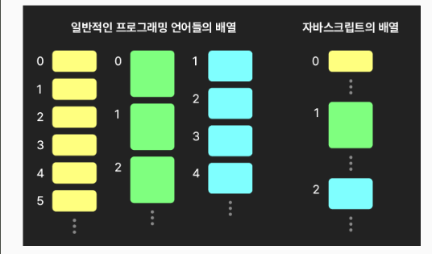
- 다른 언어들의 배열 : 전형적인 배열
  - 한 배열에는 같은 자료형의 데이터만 포함 가능
  - 데이터의 메모리 주소가 연속으로 나열
  - 접근은 빠르나 중간 요소의 추가 제거가 느림
- JS의 배열
  -⭐️ 배열의 형태와 동작을 흉내내는 특수 객체
  - 한 배열에 다양한 자료형의 데이터가 들어갈 수 있음
  - 연속 나열이 아니다 -  💡 엔진에 따라 요소들의 타입이 동일하면 연속 배열하기도...
  - 접근은 상대적으로 느림 (일반 객체보다는 빠름), 중간요소의 추가나 제거는 빠름
  - 💡 특정 자료형 전용 배열도 있음 - 더 빠름 [MDN](https://developer.mozilla.org/en-US/docs/Web/JavaScript/Reference/Global_Objects#indexed_collections)
    - 더 빠르게 해야한다면 사용해 볼 수도 있겠지.

**배열 생성 방법들**
- 배열 리터럴
  - const arr3 = [1,,2,,3] 빈 요소 property
  - arr3의 프로퍼티들 확인 빠진 인덱스 있음, 인덱스 수 < length

- 생성자 함수
  - 표준 빌트인 객체들 중 하나

- 정적 메서드 `of`
  - const arr1 = Array.of(3);

- 정적 메서드 `from`
  - 배열, 유사배열객체, 이터러블을 인자로 받아 배열 반환
  
  - 💡 유사배열객체: length와 인덱싱 프로퍼티를 가진 객체
  - 이후 배울 Map, Set 등의 이터러블로부터도 배열 생성 가능
  - **⚠️ Array.from은 얕은 복사 - 1단계 깊이만 복사**

  - **⭐️ 두 번째 인자: 매핑 함수**
  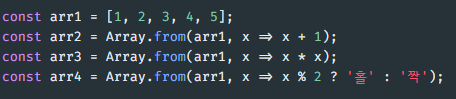
    - 매핑 mapping : 각 요소가 특정 알고리즘을 거쳐 새 값으로 반환됨
    - 곧 배울 인스턴스 메서드 map이 보다 자주 사용됨

## 배열의 기본적인 베서드들

**특정 값을 반환하는 기본 메서드들**
- (정적) `isArray` - 배열인지 여부 반환
  - instanceof Array와는 차이가 있다. 
  - **isArray가 더 권장됨**

- `at` : 주어진 인자의 인덱스 값을 반환
  - ⭐️ 음수를 사용하여 뒤에서부터 접근 가능

- `include` : 인자로 주어진 요소 유무 확인
  - **⚠️ 참조형 데이터의 경우**  : 주소값으로 파악하기 때문에 내용이 같아도 다르다고 할 수도 있음. => key 값으로 찾지 마

- `indexOf`, `lastIndexOf` - 앞/뒤에서 첫 번째 값의 인덱스 반환

- ⭐️ `join` : 인자로 주어진 값을 구분해 요소들을 문자열로 연결해서 반환

**배열을 변경하는 기본 메서드들**
- `push`, `unshift` : 배열에 값을 추가
  - 결과의 길이를 반환
  a. `push` - 값을 뒤에 추가
  b. `unshift` - 값을 앞에 추가

  **특징과 비교**
    - 수정된 배열의 길이를 반환
    - 부수효과 - 원본 배열을 변경 : 배열 마지막 강에 배울 스프레드 문법을 보다 권장
    - 💡 push보다 unshift가 더 느림 - 이후 요소들을 밀어내야 하므로

- `pop`, `shift` : 배열에서 제거해서 반환
  a. `pop` : 값을 뒤에서 제거하여 반환
  b. `shift` : 값을 앞에서 제거해서 반환
   - 💡 pop보다 shift가 더 느림 - 이후 요소들을 당겨야 하므로
  
- `splice` : 원하는 위치에 요소(들)을 추가 및 삭제
  - 2개 이상의 인자를 받음
    - `start` : 배열 변경을 시작할 위치
    - `deleteCount` : 제거할 요소의 개수
    - `item(s)` : 추가할 하나 이상의 요소
  - ⚠️ 배열의 delete - empty 값을 남김 => splice를 써라. 

- `fill` : 배열을 특정 값으로 채움
  - fill(value, [startindx])

- `reverse` : 배열의 순서를 뒤집음 
  - 원본 배열도 뒤집음

**새 배열을 반환하는 기본 메서드들**
- ⭐️ 원본 배열을 수정하지 않음
- 얕은 복사본

- `concat` : 배열에 다른 배열이나 값을 이어붙인 결과를 반환
  - 해당 배열 뒤로 인자로 하나 이상 주어진 다른 배열이나 값을 이어붙인 결과를 반환
  - 배열의 spread를 쓰는게 더 좋다

- `slice` : 인자로 주어진 범주의 값을 잘라 반환
  - 1~2개의 인자를 받음
  - begin : 시작 위치
  - end : 끝 위치

- `flat` : 인자로 주어진 깊이만큼 배열을 펼처 반환
  - 💡 flat 평평하게 한다는 의미
  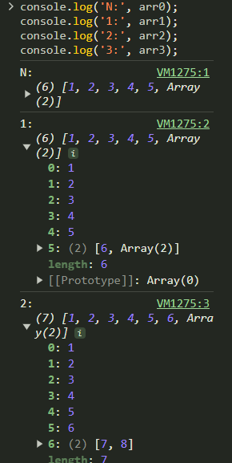

**💡 위의 메서드들은 얕은 복사**

## 고차함수 메서드들
[고차 함수 메서드](./higerorderfunction.js)
- 고차 함수란? : 다른 함수(콜백 함수)를 인자로 받는 함수
- 함수형 프로그래밍 : 변수 사용 없이 순회 작업들을 코딩

1. `forEach` - 각 요소를 인자로 콜백 함수 실행 
- 💡 for문의 좋은 대체제
- ⚠️ 단점 : 예외를 던지지 않으면 종료할 수 없음 - break, continue 사용 불가
인자들 :
- 콜백함수 - 인자 : (현재 값, 현재 값의 인덱스, 해당 배열)
  - 세번째 인자에 실제 배열을 넣어주면 > 원본 배열을 참조해서 원본 배열이 바뀔 수도 있다. 
- thisArg - this 주제 섹션에서 다룸 

- 💡 결과로는 undefined 반환 - 실행 자체를 위한 메서드

=> for of보다 좋음. 메서드 체이닝에서 유용함. 

2. `map` : 각 요소를 주어진 콜백 함수로 처리한 새 배열 반환
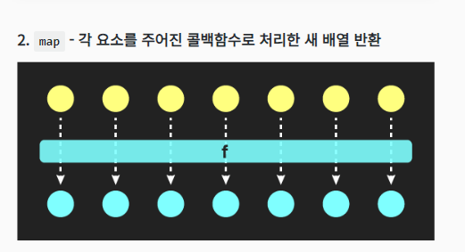
- 콜백함수 - 인자: ( 현재 값, 현재 값의 인덱스, 해당 배열 )
- thisArg
- ⭐️ 각 콜백함수는 어떤 값을 반환해야함. 
  - 즉, 원본 배열을 바꾸지 않는다. 
  - 새로운 배열을 만들어서 내보내는 것. 

3. `find`, `findLast`, `findIndex`, `findLastIndex` - 주어진 기준으로 검색
- 콜백함수로에 인자로 넣었을 때 `true`를 반환하는
- `find` - 첫 번째 값 반환
- `findLast` - 마지막 값 반환
- `findIndex` - 첫 번째 값의 인덱스 반환
- `findLastIndex` - 마지막 값의 반환
공통 인자들 : 
- 콜백함수-인자 : (현재 값, 현재 값의 인덱스, 해당 배열)
- thisArg

- 없을 시 : undefined, 인덱스는 -1 반환

4. `some`, `every` - 어떤/모든 요소가 기준을 충족하는지 확인
- 콜백함수에 인자로 넣은
- `some` - 요소들 중 하나라도 true를 반환하는가 여부 반환
- `every` - 모든 요소가 true를 반환하는가 여부 반환
인자들:
  - 콜백함수 - 인자: ( 현재 값, 현재 값의 인덱스, 해당 배열 )
  - thisArg

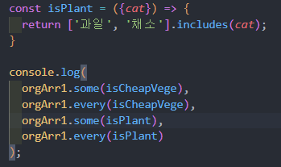

5. `filter` - 주어진 기준을 충족하는 요소들로 새 배열을 만들어 반환 
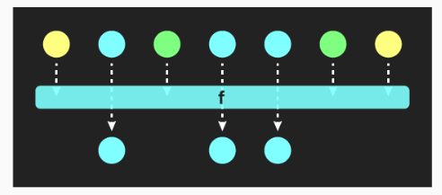
- ⭐️ 원본 배열을 수정하지 않음
인자들:
- 콜백함수 - 인자: ( 현재 값, 현재 값의 인덱스, 해당 배열 )
- thisArg

6. `reduce`, `reduceRight`
- 주어진 콜백함수에 따라 값들을 접어 나감.
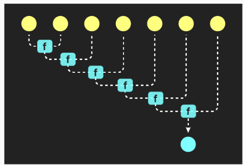
인자들:
- 콜백함수 - 인자: ( 이전값, 현재값, 현재 인덱스, 해당 배열 )
- 초기화 값
- 💡 초기화 값이 없을 때는 첫 번째와 두 번째 값부터
  - reduce((prev,curr,idx)=>{}, 초기화 값)
  - 초기화 값이 없으면 : idx = 1 부터 시작한다. 
  - 초기화 값이 있으면 : idx = 0 부터 시작한다. 
  => 초기화 값이 있으면 그 값을 0번 idx에 추가 시키는 개념이기 때문에. 
  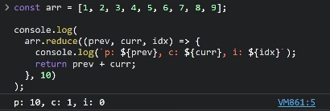

**reduce vs reduceRight**
- reduceRight는 index 거꾸로 진행됨 

- ⭐️ 만약 위 기능을 배열 메서드와 체이닝 없이 짰다면?
  - 중간 과정을 저장하기 위한 변수 또는 내용이 바뀌는 참조형 데이터들이 사용되었을 것
  - 함수형 프로그래밍 - 변수들을 코드에서 감추어 부수효과로 인한 문제 방지

7. `sort` - 배열을 (주어진 기준대로) 정렬
- ⚠️ 배열 자체의 순서를 바꿈 - 원본 수정
- ➕ 해당 배열을 반환
인자들:
  - 콜백함수(필수 아님) - 인자: ( 앞의 값, 뒤의 값 )
- ⚠️ 숫자일 시 문제가 생김
  - 문자열로 암묵적으로 변환해서 오름차순 정렬함... 1, 100 , 2, 20...

=> ⭐️ 숫자의 정확한 정렬을 위해 - 콜백 함수 사용
  - 두 인자 a와 b : 인접한 두 요소
  - 0보다 큰 값 반환 : b를 앞으로 - 순서 뒤집음
  - 0 반환: 순서 유지 - ECMAScript 표준은 아니므로 환경마다 다를 수 있음
  - 0 보다 작은 값 반환 : a를 앞으로 - 사실상 순서 유지

**추가 :브라우저마다 동작 디테일 다름**
> 인접한 앞의 것과 뒤의 것을, 콜백함수의 첫 번째와 두 번째 인자 (a, b) 중
> 어떤 것으로 받아오는지가 브라우저마다 다릅니다.
> 이 부분 때문에 아래의 실습 중 혼동이 올 수 있는데
> 끝까지 진행해보시면 큰 어려움 없이 이해하실 수 있을 것입니다.

=> 👇 브라우저마다 로그 내역이 다름 주목 크롬계열 vs 파이어폭스 등...
  => 크롬에서는 a가 앞, b가 뒤인데 firefox에서는 a가 뒤, b가 앞이어서 -1,1에 따라 다름
  => 이걸 고려해서 코딩해줘야함.
  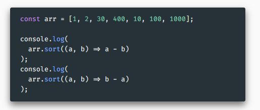
    - a와 b의 의미에 따라 반환값 양수/음수의 음수의 의미도 바뀐다. 
    - 따라서 실무에서는 실행환경을 신경쓰지 않음.
  => ⚠️ 숫자가 아닐 경우 직접 반환값을 명시
  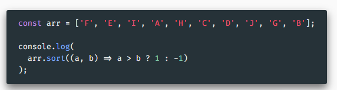
  => 💡 둘 이상의 기준 사용
  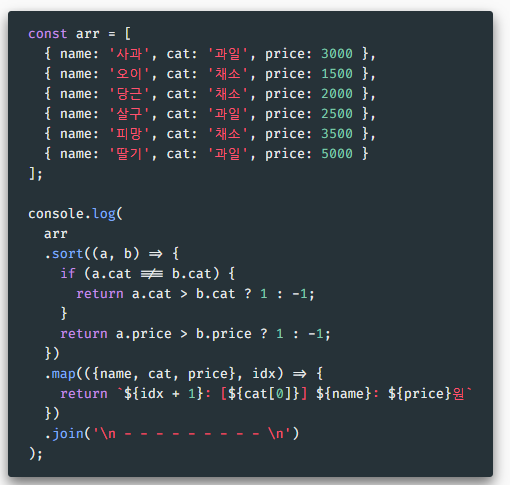

7. `flatMap` - map한 다음 flat 매핑해서 펼처짐
  * 쓸 일이 있을 까?
인자들:
  - 콜백함수 - 인자:(현재 값, 현재 값의 인덱스, 해당 배열)
  - thisArg
- 💡 한 단계만 펼친다.

## 배열의 스프레드와 디스트럭쳐링
[스프레드와 디스트럭쳐링](./spreadDist.js)
**스프레드(spread)**
- 기본 문법 : 객체랑 동일함. 
- 배열을 펼쳐서 ','로 구분한 것과 같다.
  - 여러 인자를 가지는 함수에 넣을 수 있다. 

**활용**
1. 배열을 다수의 인자들로 펼침 
2. `concat`보다 가독성있는 배열 결합. 
  - arr3 = arr1.concat(arr2) -> arr3 = [...arr1, ...arr2]
3. ⭐️ 배열의 얕은 복사
4. 💡 push, unshift 대신 사용
  - 가독성 향상
  - 배열이 든 변수의 참조값이 변할 필요가 있는 경우 (SPA 등...)
5. 원본배열을 유지한 채 일정부분만 연결하여 복사
  - `splice`는 원본 배열을 변경. 

**디스트럭쳐링(destructuring)**
- 디스트럭쳐링으로 간략화
- 일부만 가져오는 것도 가능
- 기본값 설정 가능
- 나머지 변수 사용 가능

ex) 
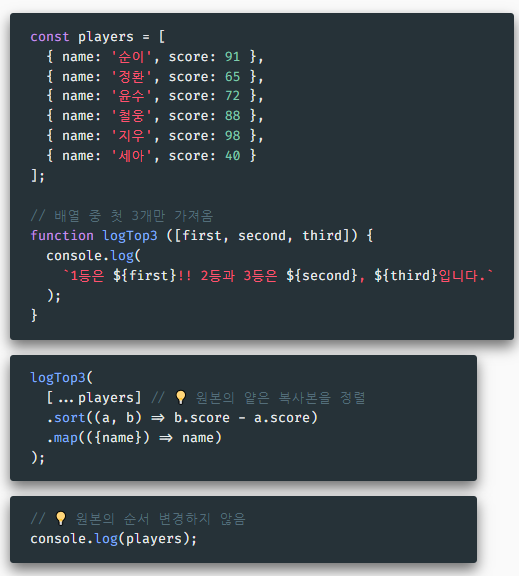
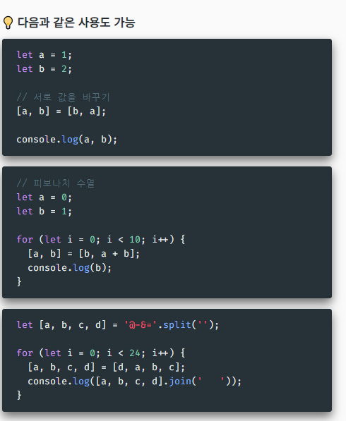
