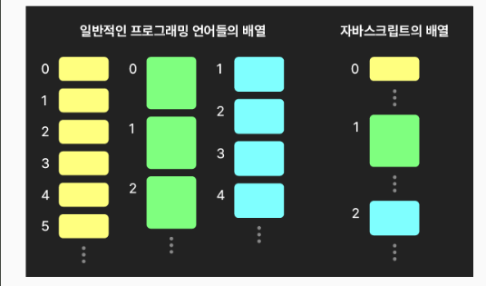
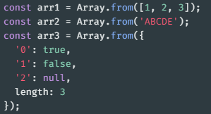
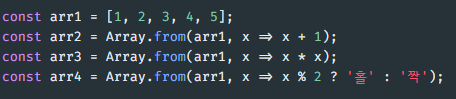
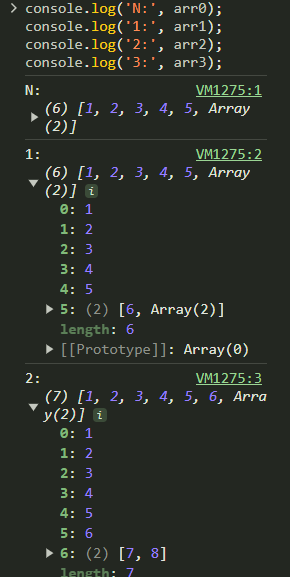

# 배열

## 자바스크립트 배열의 특징과 생성
**JS의 배열은 다른 언어들과는 다르다**

- 다른 언어들의 배열 : 전형적인 배열
  - 한 배열에는 같은 자료형의 데이터만 포함 가능
  - 데이터의 메모리 주소가 연속으로 나열
  - 접근은 빠르나 중간 요소의 추가 제거가 느림
- JS의 배열
  -⭐️ 배열의 형태와 동작을 흉내내는 특수 객체
  - 한 배열에 다양한 자료형의 데이터가 들어갈 수 있음
  - 연속 나열이 아니다 -  💡 엔진에 따라 요소들의 타입이 동일하면 연속 배열하기도...
  - 접근은 상대적으로 느림 (일반 객체보다는 빠름), 중간요소의 추가나 제거는 빠름
  - 💡 특정 자료형 전용 배열도 있음 - 더 빠름 [MDN](https://developer.mozilla.org/en-US/docs/Web/JavaScript/Reference/Global_Objects#indexed_collections)
    - 더 빠르게 해야한다면 사용해 볼 수도 있겠지.

**배열 생성 방법들**
- 배열 리터럴
  - const arr3 = [1,,2,,3] 빈 요소 property
  - arr3의 프로퍼티들 확인 빠진 인덱스 있음, 인덱스 수 < length

- 생성자 함수
  - 표준 빌트인 객체들 중 하나

- 정적 메서드 `of`
  - const arr1 = Array.of(3);

- 정적 메서드 `from`
  - 배열, 유사배열객체, 이터러블을 인자로 받아 배열 반환
  
  - 💡 유사배열객체: length와 인덱싱 프로퍼티를 가진 객체
  - 이후 배울 Map, Set 등의 이터러블로부터도 배열 생성 가능
  - **⚠️ Array.from은 얕은 복사 - 1단계 깊이만 복사**

  - **⭐️ 두 번째 인자: 매핑 함수**
  
    - 매핑 mapping : 각 요소가 특정 알고리즘을 거쳐 새 값으로 반환됨
    - 곧 배울 인스턴스 메서드 map이 보다 자주 사용됨

## 배열의 기본적인 베서드들

**특정 값을 반환하는 기본 메서드들**
- (정적) `isArray` - 배열인지 여부 반환
  - instanceof Array와는 차이가 있다. 
  - **isArray가 더 권장됨**

- `at` : 주어진 인자의 인덱스 값을 반환
  - ⭐️ 음수를 사용하여 뒤에서부터 접근 가능

- `include` : 인자로 주어진 요소 유무 확인
  - **⚠️ 참조형 데이터의 경우**  : 주소값으로 파악하기 때문에 내용이 같아도 다르다고 할 수도 있음. => key 값으로 찾지 마

- `indexOf`, `lastIndexOf` - 앞/뒤에서 첫 번째 값의 인덱스 반환

- ⭐️ `join` : 인자로 주어진 값을 구분해 요소들을 문자열로 연결해서 반환

**배열을 변경하는 기본 메서드들**
- `push`, `unshift` : 배열에 값을 추가
  - 결과의 길이를 반환
  a. `push` - 값을 뒤에 추가
  b. `unshift` - 값을 앞에 추가

  **특징과 비교**
    - 수정된 배열의 길이를 반환
    - 부수효과 - 원본 배열을 변경 : 배열 마지막 강에 배울 스프레드 문법을 보다 권장
    - 💡 push보다 unshift가 더 느림 - 이후 요소들을 밀어내야 하므로

- `pop`, `shift` : 배열에서 제거해서 반환
  a. `pop` : 값을 뒤에서 제거하여 반환
  b. `shift` : 값을 앞에서 제거해서 반환
   - 💡 pop보다 shift가 더 느림 - 이후 요소들을 당겨야 하므로
  
- `splice` : 원하는 위치에 요소(들)을 추가 및 삭제
  - 2개 이상의 인자를 받음
    - `start` : 배열 변경을 시작할 위치
    - `deleteCount` : 제거할 요소의 개수
    - `item(s)` : 추가할 하나 이상의 요소
  - ⚠️ 배열의 delete - empty 값을 남김 => splice를 써라. 

- `fill` : 배열을 특정 값으로 채움
  - fill(value, [startindx])

- `reverse` : 배열의 순서를 뒤집음 
  - 원본 배열도 뒤집음

**새 배열을 반환하는 기본 메서드들**
- ⭐️ 원본 배열을 수정하지 않음
- 얕은 복사본

- `concat` : 배열에 다른 배열이나 값을 이어붙인 결과를 반환
  - 해당 배열 뒤로 인자로 하나 이상 주어진 다른 배열이나 값을 이어붙인 결과를 반환
  - 배열의 spread를 쓰는게 더 좋다

- `slice` : 인자로 주어진 범주의 값을 잘라 반환
  - 1~2개의 인자를 받음
  - begin : 시작 위치
  - end : 끝 위치

- `flat` : 인자로 주어진 깊이만큼 배열을 펼처 반환
  - 💡 flat 평평하게 한다는 의미
  

**💡 위의 메서드들은 얕은 복사**

## 고차함수 메서드들