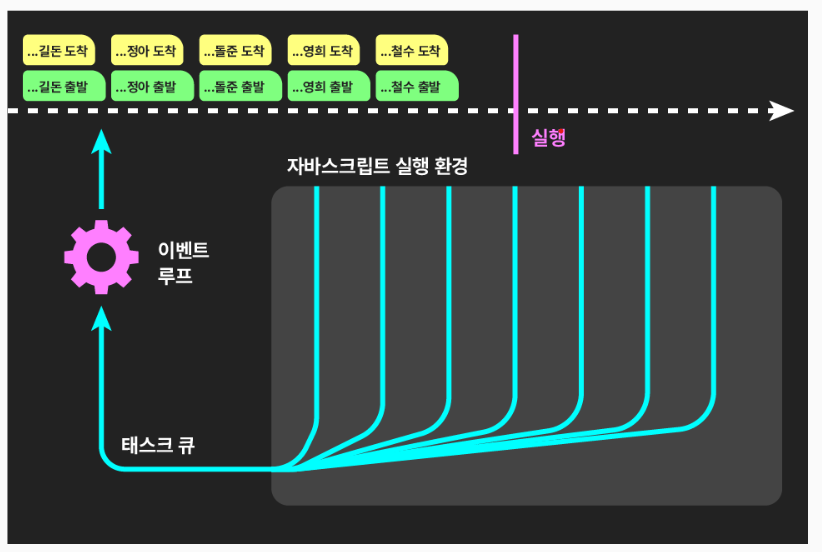
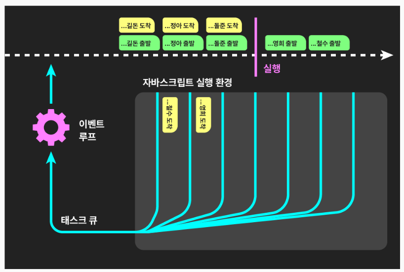
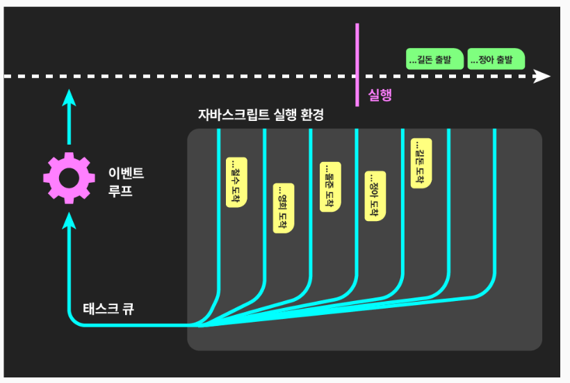
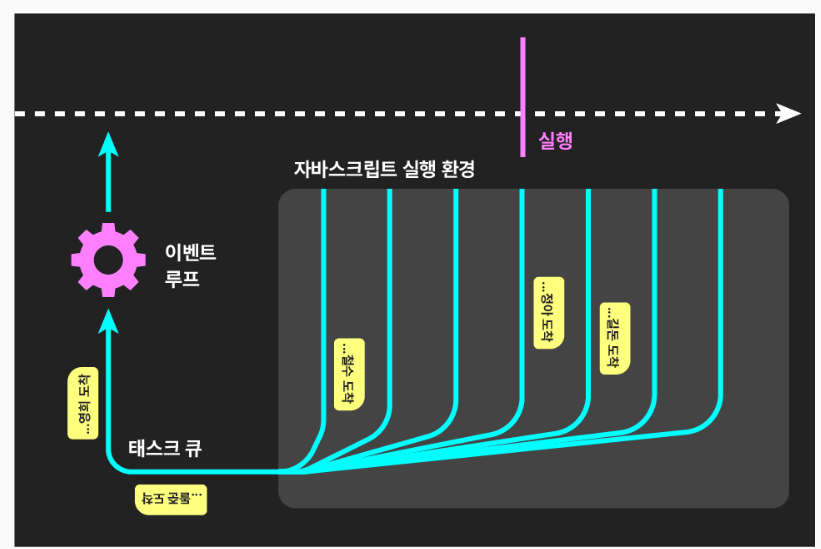
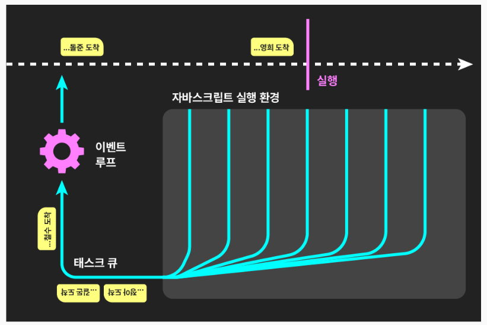
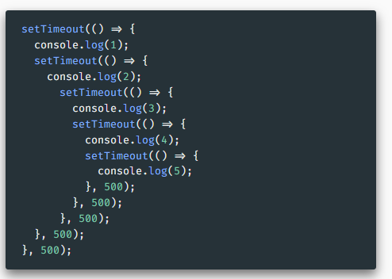

# 비동기 개념과 타임아웃 
[Asynchronous](./asyncronous.js)
⏲️ `setTimeout` 함수
[MDN]https://developer.mozilla.org/ko/docs/Web/API/setTimeout
- 첫 번째 인자로 넣은 콜백 함수를 두 번째 인자로 넣은 수 만큼의 밀리초 후 실행
- Web API, Node.js 등 자바스크립트 환경의 기능 - 언어의 기능이 아님 

## ⭐ 비동기 asynchronous 코드
- 동기 synchronous 코드와 달리, 코드가 순서대로 실행되지 않음
  - 일반적으로 타임아웃, 네트워크 요청 등 시간이 걸리는 작업에 사용
  - 당장 할 수 있는 것들을 먼저 다 하고, 시간이 걸리는 작업은 뒤로 넘기기
  - 💡 만약 비동기 방식이 없다면 - 데이터를 받아오는 동안 화면이 어는 등 불편함

🏃 달리기 경주 예제 - 코드에.

**⭐과정 설명**

- 자바스크립트의 코드는 싱글 스레드로 실행 - 외나무다리
  => JavaScript 엔진이 한줄로 테스크를 진행한다. 

- 실행시점에 도착하면 동기 코드는 실행
- 비동기 콜백 코드는 환경(Web API 등)으로 넘겨줌

- 자바스크립트의 실행환경은 멀티스레드 - 다차선 도로
- 여러 작업들이 동시다발적으로 진행될 수 있음
  - **코드는 싱글 스레드로 돌아가지만, Node.js나 브라우저에서 Multi 스레드로 작업하기 때문에 비동기는 동시에 처리된다.**

- 주어진 작업을 마친 작업들은 태스크 큐 task queue 선로로 진입한다. 

- 이벤트 루프 event loop - 태스크 큐의 작업이 도착하는대로 자바스크립트 실행도로에 올려 놓는다
- 동기 코드가 모두 실행된 다음 진행된다 - 지연 시간을 0으로 해도 나중에 실행되는 이유. 
[MDN - 이벤트 루프](https://developer.mozilla.org/ko/docs/Web/JavaScript/Event_loop)

## Promise
[Promise](./promise.js)
- 콜백 지옥 callback hell

💡 연속적으로 비동기 코드를 써야 하는 경우
- 위와 같이 콜백 함수 안에 또 다른 콜백 함수를 넣어야 하는 상황 발생 - 콜백 지옥
- 횟수가 많을수록 가독성도 낮아지고 직관성이 떨어짐
- 실전에서는 더더욱 복잡하고 난해해짐

🏃🏃🏃 릴레이 예제
- 철수, 영희, 돌준, 정아, 길돈이 치례로 이어달리기는 하는 코드
- ⭐ 각 골인시간 기록 - 이전 콜백함수의 결과가 다음 콜백함수로 넘겨져 축적됨
- 한 주자라도 데드라인(밀리초)을 넘기면 실패 - 주자마다 다른 실패 메시지 출력
- 완주 실패시 😢 완주 실패 - ${전체 소요시간} 출력
- 실패든 성공이든 마지막에 - - 경기 종료 - - 출력

**프로미스 Promise**
- (보통 시간이 걸리는) 어떤 과정 이후 주어진 동작을 실행할 것이란 약속
- 중첩된 비동기 코드를 직관적이고 연속적인 코드로 작성할 수 있도록 함
[MDN](https://developer.mozilla.org/ko/docs/Web/JavaScript/Reference/Global_Objects/Promise)

- 생성자 Promise - 👉 [MDN 문서 보기](https://developer.mozilla.org/ko/docs/Web/JavaScript/Reference/Global_Objects/Promise/Promise)
  - 새로운 약속을 하는 코드
  - 인자로 받는 콜백함수의 첫 번째 인자 resolve ( 이름은 관례 ) - 약속 이행 성공시, 반환할 값 넣어 실행
- 프로미스 인스턴스 ( 만들어진 약속 ) 의 then 메서드
  - `resolve`를 통해 ( 약속대로 ) 반환된 결과를 인자로 하는 콜백 함수를 넣음
  - ⭐ 또 다른 프로미스를 반환 - 체이닝 가능
  - 👉 [MDN 문서 보기 - ( 추가 인자 )](https://developer.mozilla.org/ko/docs/Web/JavaScript/Reference/Global_Objects/Promise/then)
- `reject`와 `catch` :  실패했을 시 콜백 함수 
- `finally` : 성공하든 실패하든...

- 생성자 `Promise`
  - 인자로 받는 콜백함수의 두 번째 인자 `reject` ( 이름은 관례 ) - 약속 이행 실패시, 반환할 값 넣어 실행
  - `reject`가 실행되면 `resolve는` 무시됨
- 프로미스 인스턴스의
  - `catch` 메서드 : `reject`를 통해 ( 실패로 인해 ) 반환된 결과를 인자로 하는 콜백 함수를 넣음
  - `finally` 메서드 : 성공하든 실패하든 실행할 콜백 함수 - 필요할 때만 사용
  - `then`과 더불어 메서드 체이닝으로 사용

=> ⭐ then은 연속적으로 메서드 체이닝 가능
=> 코드에 💰 10% 이자, 채무자 파산가능성 10%, 5번 빌려주기를 참고
=> [relay 코드 변경](./myPractice.js)

## 프로미스의 병렬 진행
[프로미스 병렬 진행](./promiseParalell.js)
- 여러 프로미스를 병렬 처리하기 위한 Promise의 정적 메서드들. 

1. `all` 
[MDN](https://developer.mozilla.org/ko/docs/Web/JavaScript/Reference/Global_Objects/Promise/all)
- 프로미스의 배열을 받아 동시에 진행
- 모두 성공하면 `resolve`된 값들을 배열로 반환 - `then`으로 받음
- 하나라도 실패하면 `catch` 실행

2. `allSettled`
[MDN](https://developer.mozilla.org/ko/docs/Web/JavaScript/Reference/Global_Objects/Promise/allSettled)
- 주어진 프로미스들의 결과를 배열로 출력
- 실패 유무 관계없이 then으로 배열 반환

3. `any`
[MDN](https://developer.mozilla.org/en-US/docs/Web/JavaScript/Reference/Global_Objects/Promise/any)
- 가장 먼저 성공한 프로미스의 결과를 then으로 반환
- 모두 실패시 오류 발생

4. `race` 
[MDN](https://developer.mozilla.org/ko/docs/Web/JavaScript/Reference/Global_Objects/Promise/race)
- ⭐ 성공이든 실패든 첫 결과물을 `then` 또는 `catch`로 반환

## async & await

**`async`**
- 프로미스를 기반으로 동작
- 마치 동기 코드처럼 직관적으로 코딩 가능
[MDN](https://developer.mozilla.org/ko/docs/Web/JavaScript/Reference/Statements/async_function)
- ⭐ `await` - 코드의 진행을 멈추고 프로미스로부터 답을 받아냄
- 💡 `await`은 `async` 함수 또는 모듈 내에서만 사용 가능

-> async&await 예제 
- 💰 10% 이자, 채무자 파산가능성 10%, 5번 빌려주기

**🏃🏃🏃 릴레이**

## 네트워크 통신에서의 활용
[네트워크 통신](./useNetwork.js)

**Fetch API**
- Web API에서 제공하는 기능 - 즉 브라우저에서 제공
- 네트워크로부터 리소스를 받아오기 위한 다양하고 강력한 기능들 제공 
[MDN](https://developer.mozilla.org/ko/docs/Web/API/Fetch_API)
- 보다 오래된 방법 : XMLHttpRequest

`fetch` 메서드
- 네트워크 통신으로 원격에 요청을 보내고 답을 받아오는 프로미스를 반환
[MDN](https://developer.mozilla.org/en-US/docs/Web/API/fetch)
- **반환되는 결과 ( response )**
- 요청의 결과에 대한 정보들을 담은 객체
- `json` 메서드 - 결과의 body로 받은 텍스트를 JSON 객체로 변환하여 반환
=> 주소 등이 잘못된 경우 등 에러상황시 catch에서 처리

**🔗 연속 fetching 예제**
-> 소스 코드에 1. Promise 2. async await
