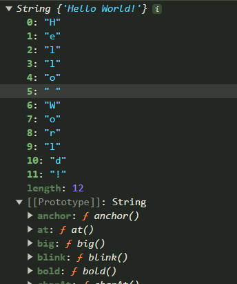
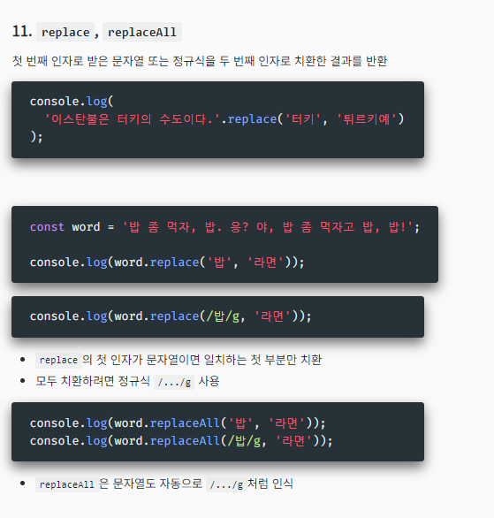
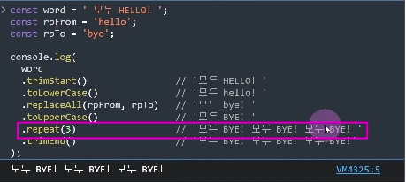
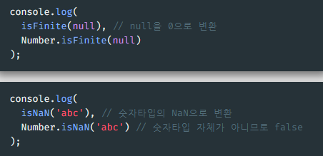
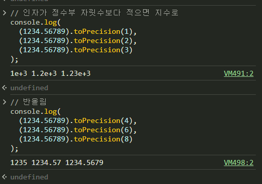

# 빌트인 객체

## 전역 객체와 표준 빌트인 객체
[전역 객체와 표준 빌트인](./globalobject.js)
**전역 객체(global object)**
- 언제 어디서든 들어마실 수 있는 공기와도 같은....
- 코드로 선언하거나 하지 않아도 전역 범위에 항상 존재하는 객체
- 브라우저에서 this는 window임.
- node.js와 브라우저의 this는 다르다.
- console.log(globalThis);

**전역 객체에 포함되는 것**
1. 표준 빌트인 객체
2. 호스트 객체 - 환경에서 제공하는 기타 객체들 : 브라우저의 WebAPI, Node.js API EMD
3. (브라우저 한정) - 전역으로 설정한 `var` 변수와 전역 변수

**표준 빌트인 객체**
[MDN 참고 하면 좋습니다!](./https://developer.mozilla.org/ko/docs/Web/JavaScript/Reference/Global_Objects)
- ECMAScript 사양에 정의된 객체들 - 어떤 환경에서든 사용 가능
- 전역 프로퍼티로 제공됨 : `globalThis`를 붙이지 않아도 바로 사용 가능. 
- Node.js에서는 globalThis를 출력해도 표준 빌트인 객체는 출력하지 않음. 

**래퍼 객체 (wrapper object)**
- num.toString, toFixed, length.... 처럼 원시값이 갖고 있는 프로퍼틴
- 💡 콘솔에서 프로퍼티와 프로토타입을 펼쳐 확인해보자 >> ProtoType에 프로퍼티들이 들어 있음!
- const str = 'abcde' 이런식으로 만들어도 `String`, `Number`, `Boolean` 등은 표준 빌트인에 속하는 래퍼 객체이다
  - 필요시에 원시값을 래퍼 객체로 감싸서 그것의 인스턴스로 만들어서 기능을 실행한다
  - 원시값에서 객체를 사용하듯 해당 래퍼 객체의 프로퍼티를 호출할 때 래핑이 발생
  - ⭐️ 해당 기능 사용 후에는 원시 객체로 돌아감 - 메모리 절약
- valueOf 함수 - 래퍼 객체의 인스턴스에서 원시값 반환

## 빌트인 전역 프로퍼티와 함수
[빌트인 전역 프로퍼티와 함수](./builtingpf.js)
**빌트인 전역 프로퍼티**
- 스스로 다른 프로퍼티나 메서드를 갖지 않고 값만 반환
- `Infinity`, `NaN`, `undefined` 등의 원시값들은 이 프로퍼티들을 가리킴
- 💡 `null`은 포함되지 않음 - 가리키는 값이 없음을 의미하므로...
- globalThis 스스로에 대한 참조를 프로퍼티로 포함 ex) globalThis.globalThis...

**빌트인 전역 함수**
1. `eval` - 문자열로 된 코드를 받아 실행 << 절대 사용 X
- 값을 반환하는 코드(표현식)이라면 해당 값을 반환
- ⚠️ 매우 특별한 경우가 아닌 이상 절대 사용하지 말 것
  - ☢️ 보안에 취약함
  - 엔진이 코드를 최적화하지 못하므로 처리 속도가 느림

2. isFinite - 유한수 여부 반환
- 유한수이거나 유한수로 평가되는 (null은 0) : true
- 무한수이거나 수로 평가될 수 없는 값 : false

3. is NaN - NaN 여부 반환
- 숫자로 인식될 수 없는 값 : true
- Number 타입이 아닐 경우 Number로 변환해서 평가 : NaN 타입은 Number
- 💡 뒤에배움 Number.isNaN은 타입 변환 X

4. parseFloat - 인자로 받은 값을 실수로 변환
- 문자열의 경우 앞뒤공백은 무시
- 숫자로 시작할 경우 읽을 수 있는 부분까지 숫자로 변환
- 배열의 경우 첫 요소가 숫자면 해당 숫자 반환
- 기타 숫자로 변환이 안 되는 경우 NaN 반환

5. parseInt - 인자로 받은 값을 정수(타입은 실수)로 변환
- 소수점 뒤로 오는 숫자는 `버림` - 반올림 하지 않음. 
- 두 번째 인자로 숫자(2~36) 넣으면 주어진 값을 해당 진법의 숫자로 해석해서 10진법 숫자로 반환
- 무효한 숫자는 NaN 반환

6. ⭐️ **encodeURI, encodeURIComponent**
- URI(인터넷 자원의 주소)는 아스키 문자 셋으로만 구성되어야 한다.
- 아스키가 아닌 문자(한글 등)와 일부 특수문자를 포함한 URI를 우효하게 인코딩
💡 둘의 정확한 차이(encodeURI vs encodeURIComponent)
  - URI에서 특정 기능을 갖는 `=`, `?`, `&` 등을 인코딩하는가의 여부
  - encodeURI는 ?같은 쿼리는 변환 하지 않지만 Component는 전부 변환 해버림
  - encodeURI는 인자를 완성된 URI로, encodeURIComponent는 요소로 인식하기 때문

7. **decodeURI, decodeURIComponent**

## String 객체
[String 객체](./StringObject.js)
[String MDN](https://developer.mozilla.org/ko/docs/Web/JavaScript/Reference/Global_Objects/String)

**생성자 함수**

**유사 배열 객체**
- string은 유사 배열 객체이다.
- myStr[index]= '?'; 로 접근해도 배열과 달리 바뀌지 않는다. 
  - string은 원시값이기 때문이다. 
  - 읽기만 가능하다. 
- for ... of문 사용 가능 이후 배울 이터러블이기 때문

**⭐️ String은 원시값**
- [] 접근 또는 인스턴스 메서드로 특정 글자만 수정이 불가한 이유
- 수정하려면 변수 값 자체를 다른 문자열로 대체해야함.

**주요 인스턴스 메서드**
1. toUpperCase, toLowerCase
  - 라틴어 문자를 모두 대문자/ 소문자로 변경해서 **반환**
  - ⭐️ 기존의 문자열은 바꾸지 않음! 다음의 메서드들 모두 마찬가지
  - 활용 예) 모두 소문자로 바꿔서 특정 단어들을 검색할때 대/소문자에 구애받지 않도록.

2. ✨`at`
  - 신기능, 배열에서도 사용 가능하다.
  - **✨음수로 뒤에서부터 접근 가능하다. (-1)**

3. **indexOf, lastIndexOf**
  - 인자로 주어진 문자열이 앞, 또는 뒤에서 처음 나타나는 인덱스 반환
  - 포함되지 않을 시 -1 반환

4. **includes, startWith, endWith**
  - 인자로 주어진 문자열 포함 ( 아무것에 / 맨 앞에/ 맨 끝에) 여부 boolean으로 반환  

5. search
  - 인자로 받은 정규표현식과 일치하는 첫 부분의 인덱스 반환
  - 없을 시 -1 반환
    - `정규 표현식` ? 문자를 특정한 방식으로 표현한 것. 

6. substring
  - 인자로 전달받은 인덱스(들)을 기준으로 문자열을 자르고 `반환`.
  - word.substring(4,8) start~end까지
  - 인자를 하나만 넣으면 해당 인덱스부터 끝까지
    - 음수나 범위 외 숫자는 범위 내 최소/최대 숫자로.
  
7. slice
  - `substring`과 같으나 음수로 뒤에서부터 자를 수 있다.

8. ✨split
  - 인수로 주어진 문자열이나 정규표현식으로 분리하여 배열 반환
  - 두 번째 인자로 배열의 최대 길이 지정 가능.

9. trim, trinStart, trinEnd
  - 앞뒤의 공백 제거하여 변환
  - 중간의 공백은 제거하지 않는다. 

10. repeat
  - 인자로 주어진 정수만큼 문자열을 반복해서 반환
  - 인수가 없거나 0이면 빈 문자열 반환, 음수면 오류 발생

11. ✨replace, replaceAll
  - 첫 번째 인자로 받은 문자열 또는 정규식을 두 번째 인자로 치환한 결과를 반환
  - replace의 첫 인자가 문자열이면 일치하는 첫 부분만 치환
  - 모두 치환하려면 정규식 /.../g 사용
  - replaceAll은 문자열도 자동으로 /.../g 처럼 인식.
  

### ⭐️ 메서드 체이닝 method chaining
- **값을 반환하는 인스턴스 메서드를 연속**으로 사용
 
 - 함수 형 프로그래밍에서 굉장히 많이 사용되는 메서드 체이닝!! 
 - 배열에서 콜백함수와 함꼐 많이 사용!!
 - 연속된 작업을 많이 할 수 있따..!!
 - 메서드 체이닝이 없으면 변수를 많이 사용해야하는데 -> 변수는 프로그래밍의 위협 요소다!!!!
=> 결론! 메서드 체이닝 좋다!!!

## Number
[Number](./NumberObject.js)
**생성자 함수**
- 인자가 없을 시 0
- true : 1, false : 0
- 숫자가 안되면 NaN

- new 없이 사용하면 알제?<<모르면 스트링 참고

**정적 프로퍼티**
1. EPSILON
  - Number형에서 표현 가능한 1보다 큰 가장 작은 수
  - 부동소수점으로 인한 계산오차 문제 해결에 사용
  - 0.1 + 0.2는 0.3000....으로 나오는데, (0.1+0.2)-0.3<(EPSILON) 이런식으로 사용
  - 근데 걍 라이브러리 써서 가능함

2. MAX_VALUE, MIN_VALUE
  - 자바스크립트에서 가장 크고 작은 수들

3. MAX_SAFE_INTEGER, MIN_SAFE_INTEGER
  - 자바스크립트의 부동소수점 체계에서 안정적으로 나타낼 수 있는 가장 큰 수와 작은 정수
  - 더 큰 정수도 표현 자체는 가능 : 안전하게 하려면 BigInt 타입으로

4. POSITIVE_INFINITY, NEGATIVE_INFINITY
  - 양과 음의 Infinity

5. NaN
  - 전역 객체(globalThis)의 NaN과 같은 값.

**정적 메서드**
1. 전역 객체에도 있는 메서드들
  a. 동일하지 않음 : isFinite, isNaN
    - ⭐️ 전역 객체 (globalThis)의 해당 메소드와의 차이: 암묵적 타입 변환을 하지 않음
    - isFinite(전역 객체)는 유도리 있게 숫자로 변환해서 반환한다는 것.
    
  b. 동일함 : parseInt, parseFloat
    - 각각 전역의 동명 메서드들을 가리킴 🔗 parseInt 🔗 parseFloat
    - 둘 다 같은 기능
2. (안전한) 정수 여부 확인 : isInteger, isSafeInteger
  - 안전한 정수 범위인지

**인스턴스 메서드**
- ⭐️ 값 자체에서 호출시 괄호로 감쌀 것 소수점과 구분 불가하므로
1. toExponential
  - 지수 표기법으로 나타내는 문자열을 반환

2. toFixed
  - 최대 인자값으로 주어진 정수(0~20)만큼 소수점 이하를 반올림해서 문자열로 반환

3. toPrecision
  - 반올림과 지수 표기법을 사용해서 문자열 반환
  

4. toString
  - 문자열 값 반환
  - 인자 2~36가 주어지면 해당 수의 진수로 표현. 
  