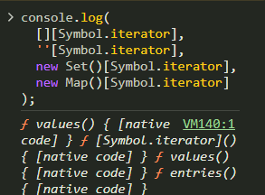

# 이터러블과 제네레이터

## Set
[Set](./Set.js)

**중복되지 않는 값들의 집합**
- 표준 내장 객체 중 하나
- 💡 배열과의 차이:
  - 동일한 값을 여러 번 포함할 수 없음
  - 값들의 순서가 무의미함
- `has` 메서드 - 요소 포함여부 확인
- `delete` - 요소 삭제, 성공 여부 반환
- set은 key와 value가 같음. -> keys, values 
- `clear` - 비워버림

**참조형 데이터의 경우**
- .set({x:1,y:2}) 2번 넣어도 중복 x
  => set은 메모리 위치 기반으로 하기 때문. 

**이터러블로서의 Set**
- for ...of
- spread 문법 -> 활용 : 중복을 제거한 배열 반환
- 디스트럭쳐링 
- 💡 이터러블과 별개 - `forEach` 메서드도 사용 가능

## MAP
- 키와 값의 쌍으로 이루어진 컬렉션
💡 객체와의 차이:
  - 이터러블의 일종 (이터러블의 기능 사용 가능)
  - 메서드와 프로퍼티 등의 기능 차이
  - 객체나 배열 등의 `참조값`을 키로 사용 가능
  - ⭐️ 키와 값을 보다 자주 변경하는 경우 적합하도록 설계됨

**기본 사용법**
- new Map(); 
  - new Map([['X',1],['N',2],]) : 배열로 초기화
  - `set` : 키-값 추가
  - `has` : 요소 포함 여부 확인
  - `get` : 값에 접근
  - 참조값도 키로 사용 가능. -> 주소값을 사용하는 것. 
    -> Map.js 보기
  - `delete` : 요소 제거, 성공 여부 반환
  - `size` : 요소 개수
  - `clear`, `keys`, `values`, `entries`

**이터러블로서의 Map**
- for of
- 스프레드
- 디스트럭쳐링
💡 이터러블과 별개 - forEach 메서드도 사용 가능

## 이터러블
**이터러블 프로토콜 iterable protocol**
- 반복, 순회 기능을 사용하는 주제간의 통일된 규격
- 공통 기능들 : `for ... of`, 스프레드 문법, 배열 디스트럭쳐링

**이터러블 iterable** - 이터러블 프로토콜을 준수하는 객체를 의미한다. 
- 배열, 문자열, set, map, arguments 등...
- 키 `symbol.iterator` ( well-know 심볼 )의 값으로 이터레이터를 반환하는 메서드를 가짐
  - 만들어서 출력해보면 symbol.iterator 라는 키를 가진 메서드를 갖고 있다. 
[well-know symbol MDN](https://developer.mozilla.org/en-US/docs/Web/JavaScript/Reference/Global_Objects/Symbol#well-known_symbols)

**이터레이터 iterator**
- `next` 메서드를 통해 이터러블을 순회하며 값을 반환

- **이터레이터 프로토콜 iterator protocol**
  - `next` 메서드의 반환 객체 내 요소
    - `value` - 해당 차례에 반환할 값
    - `done` - 순회 종료 여부 ( 마지막 값 반환 다음 차례부터 )

**이터러블 만들어보기**
[이터러블](./iterator.js)
- 1. 주사위 열번 굴리는 이터러블
- 2. 🧮 피보나치 이터러블
- 3.  ⌛️ 순번 이터러블 X 이터레이터

### 번외 
**이터레이터, 이터러블 차이**
- 수업을 들어도... 둘의 차이를 제대로 잘 모르겠어서 한 번 알아보고 가자. 
1. `이터러블` : 반복 가능한 `객체`를 의미한다. -> 배열, 문자열, set, map....
2. `이터레이터` : 이터러블에서 값을 하나씩 가져오는 객체. 이터러블에서 iter 메서드를 통해 반환된 이터러블 객체는 next메서드를 구현해서 이터러블 다음 값을 반환할 수 있다.
