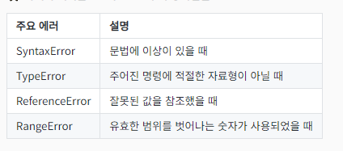

# 문제들에 대비하기 

## 에러 핸들링 
- 에러 발생에 대비하지 않으면 프로그램이 종료된다. 

### 자바스크립트의 에러 핸들링
[에러 핸들링](./errorhandling.js)
1. `try ... catch` 문
- `try` 블록
  - 에러 발생 여지가 있는 코드 포함
  - 이곳에서 발생한 에러는 프로그램을 멈추지 않음
- `catch` 블록
  - 에러 발생시 실행할 코드 포함
  - 발생한 오류 객체를 인자로 받음
- 오류가 생길 것 같은 부분에 사용

2. `try .. catch .. .finally`
- `finally`블록
- return을 넣어도 finally는 실행을 하고 종료한다.

### Error 객체
- 에러 발생 시 던져지는 thrown 객체
- 에러에 대한 정보를 담고 있음
- 💡 에러가 발생하지 않아도, 직접 생성하여 던지기 가능
- ⭐ 의도적으로 에러 발생시키기

**에러의 여러 종류**
- ⭐ 아래의 에러들은 모두 Error부터 상속받음

- 어떤 문제에 의한 에러인지 쉽게 식별 가능하도록 함

- 💡 오류에 종류에 따라 대처하기 가능
- 💡 직접 오류를 생성하여 던지기
  - 컴퓨터가 인지하지 못하는 에러 수동 발생

- 커스텀 에러 만들기도 가능

### 에러 버블링 error bubling
- 다른 함수를 호출했을 때
  - 에러 발생시 해당 함수에서 잡지 않으면 호출한 곳으로 던져짐
  - 다중 호출시 에러를 핸들링하는 코드가 있는 호출자까지 전달됨.
- ⭐ 에러는 가능한 발생 곳 가까이서 처리하는 것이 좋음

## var

## 엄격 모드 (strict mode)
- JS는 기존의 느슨한 모드에서 허용되던, 문제를 유발할 수 있는 코드들에 오류를 발생시킨다.
  - "지금부터 대충 넘어가지 않겠다!"

**엄격 모드의 적용 방법과 그 효과들 예시**
1. 선언되지 않은 변수 사용시 오류 발생 + 범위별 적용 방법
- 원래는 선언 안되면 var로 할당했다.
- `use strict`
  - 자바스크립트 문서 최 상단에 작성 - 문서 전체에 적용
  - 문서, script 태그별로만 적용 - 여러 .js 파일이 페이지에 사용될 시 각각 작성해야한다.

2. 변수, 함수, 인자 등 삭제불가한 것을 삭제시 오류 발생

3. 인자명 중복시 오류 발생

=> 💡 실무에서의 엄격 모드
- 클래스나 모듈(등 ES6와 그 이후의 기능들) 사용시 엄격 모드가 기본으로 적용됨
- 🪄 모든 문제를 방지하는 수단이 되지 않음 기억
- ⚠️ 기존 코드에 엄격모드 적용시 주의 - 예기치 못한 오류 발생 가능

## ⭐옵셔널 체이닝
[옵셔널 체이닝](./optionalChaing.js)
[MDN](https://developer.mozilla.org/ko/docs/Web/JavaScript/Reference/Operators/Optional_chaining)

**유효하지 않을 수 있는 참조에 의한 문제들**
- 🌐 네트워크 요청 등, 어떤 값이 들어올지 모르는 상황에서
- ⚠️ 에러가 발생하는 상황들
  - undefined로부터 값에 접근할 때
  - null부터 값에 접근할 때
  - 무효한 배열에 접근할 때
  - 존재하지 않는 함수를 호출할 때
=> 네트워크를 통해 받아오는 값에서 들어있는 값을 예측할 수 없을 때가 있다. 

**다음과 같은 상황에서 에러를 피하려면?**
- 결과에 `prop3`이 있다면 가져와야 하는 상황
  1) if문을 쓴다 -> 다중 if는 콜백 지옥과 같이 별로 좋진..
  2) &&(AND) 연산을 쓴다. 
  3) try... catch 사용 

### `?.` - 옵셔널 체이닝 optional chaining 연산자
- 호출 댇상이 `undefined`나 `null`이어도 오류를 발생시키지 않는다 - 대신 undefined를 반환
- 있을지 없을지 모르는 것으로부터 값을 읽거나 실행할 때 사용 

**💡 유무가 불확실한 함수를 호출할 때도 유용**
