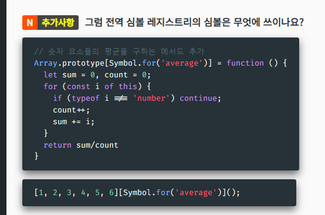

# 추가 자료형 

## 진법
- 2진법 0b01 0b001 .... 0b로 시작
- 8진법 0o
- 16진법 0x

⭐️ 진법 간 변환
- const binStr = num.toString(2); // 2진법 변환... 들어가는 숫자 별로 변환
- parseInt(binStr, 2) : 2진수로 다시 변환

**비트 연산 자들**
[MDN](https://developer.mozilla.org/ko/docs/Web/JavaScript/Guide/Expressions_and_Operators#%EB%B9%84%ED%8A%B8_%EC%97%B0%EC%82%B0%EC%9E%90)
- `&` : AND,  `|` : OR,  `^` : XOR, `~` : 반전
- `<<` ,`>>` : SHIFT

## ⭐️ BigInt
[MDN](https://developer.mozilla.org/ko/docs/Web/JavaScript/Reference/Global_Objects/BigInt)
[BigInt](./BigInt.js)
- `Number.MAX_SAFE_INTIGER` 더 큰 정수를 다루기 위한 자료형
- 매우 큰 정수를 다뤄야 하는 특수한 경우에 사용 
- `number` 타입으로 안정적으로 표현할 수 없는 경우 사용

**`BigInt`의 특징들**
- 일반 number 타입과 산술 연산 불가.
- 비교 연산 가능
- number 숫자와 섞여 정렬 가능
- 불리언으로 변환되는 연산 가능
- 소수점 아래는 그냥 버림 (반올림 아님)
- Math의 정적 메서드에서 사용 불가
- number로 변환 - `정확성 유실 주의!` << number 자료형 범위 넘으면 유실됨

## Symbol
- 다른 값과 절대 중복되지 않는 유일무이한 값
[MDN](https://developer.mozilla.org/ko/docs/Web/JavaScript/Reference/Global_Objects/Symbol)

**기본 생성과 활용**
- symbol은 생성시 new를 쓰지 않는다 >> 생성자 함수가 아니라는 것.
  => class가 아닌 js의 독특한 자료형이라는 것. 

- 문자열 값을 인자로 줄 수 있음
  - 해당 심벌에 대한 설명일 뿐, 각 심벌의 값은 유일무이

**⭐️ 객체에서의 활용**
- 객체의 키로 사용시: [, ]로 감쌈
  - key값을 안다고 외부에서는 접근하지 못하게 막을 때 활용
- ⭐️ for in, keys, values, entries, getOwnPropertyNames 등으로 접근 불가능하다. 

**전역 신볼 레지스트리 global symol registry**
- 키가 중복되지 않는 심볼들이 저장되는 공간

`Symbol`의 정적 메서드들
- `for` : 주어진 인자로 전역 심볼 레지스트리에 하나의 심볼 생성 및 반환
- `keyFor` : 정적 심볼 레지스트리에 저장된 심볼의 키 반환

**전역 심볼 레지스트리의 심볼은 어디에다 쓰이나?**
위와 같이 표준 빌트인 객체에 직접 만든 메서드를 만들어 넣을 경우
이후 버전의 자바스크립트에서 같은 이름으로 메서드가 추가되더라도
커스텀 메서드가 덮어씌워지지 않도록 하기 위한 용도로 쓰일 수 있습니다.

