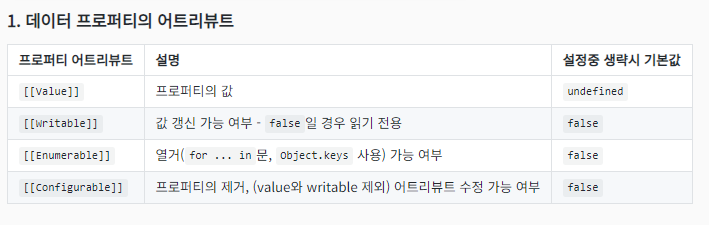
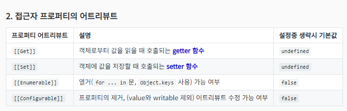
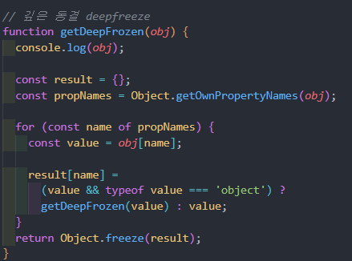

# Object
- 자바스크립트 객체들의 원형

## Object
[Object](./object.js)
**주요 정적 메서드**

1. `assign` - 인자로 주어진 객체(들)의 프로퍼티를 대상 객체에 붙여넣음 
  - ⭐️ 대상 객체를 변경
  - 결과 객체를 반환
  - ⚠️ 얕은 복사
  인자들 : 
    - 대상 객체
    - 원본 객체(들)
  - 중복 키값은 뒤에 오는게 덮어 씀
  - 얕은 복사

2. `keys`, `values`, `entries` - 객체의 키/값/{키,값}을 배열로 반환
  - Object.keys(obj)

3. `preventExtensions`- 프로퍼티 추가 금지
  - isExtensible - 해당 여부 확인(false/true)
  - 추가 안됨, 수정은 가능

4. `seal` - 프로퍼티 추가와 삭제 금지
  - `isSealed` : 해당 여부 확인 (true/false)
  - 추가 및 삭제 안됨, 수정은 가능

5. `freeze` - 객체 동결 - 읽기만 가능
  - `isFrozen` - 해당 여부 확인
  - 아무것도 안돼!
  - 얕게만 적용 된다. << 객체 안에 들어있는 객체의 프로퍼티는 변경 가능 
  => deepfreeze가 있다. 

## Property Attributes
[프로퍼티 어트리뷰트](./propertyattribute.js)
- 객체의 프로퍼티가 생성될 때 엔진에 의해 자동 정의되는 상태
💡 프로퍼티에는 두 종류가 있음
  - 데이터 프로퍼티 
  - 접근자 프로퍼티

**`Object`의 프로퍼티 어트리뷰트 관련 정적 메서드들**
1. `getOwnPropertyDescriptor`, `getOwnPropertyDescriptors`
  - 객체 프로퍼티 어트피뷰트들의 설명자 descriptor를 반환

2. `defineProperty`, `defineProperties`
  - 객체의 프로퍼티를 정의
  => 솔직히 쓸 일이 많진 않음

**깊은 동결(deep freeze)**
- 재귀적으로 객체를 가장 깊숙하게까지 동결
- [🔗 MDN 문서](https://developer.mozilla.org/ko/docs/Web/JavaScript/Reference/Global_Objects/Object/freeze)의 deepFreeze 예시와는 달리, 주어진 인자 자체를 변형하지 않도록

## JSON (JavaScript Object Notation)
- 복잡한 구조를 가질 수 있는 데이터를 한 줄의 문자열로 표현
- 서버와 클라이언트 등 데이터들을 주고받는 주체들 사이에 널리 사용
[Yalco XML, JSON, YAML](https://www.youtube.com/watch?time_continue=3&v=55FrHTNjTCc&embeds_referring_euri=https%3A%2F%2Fwww.yalco.kr%2F&source_ve_path=Mjg2NjY&feature=emb_logo)
[XML, JSON, YAML 간략 설명](./Plus.md)

**JSON 객체의 정적 메서드**
1. `stringfy` - 객체를 문자열로 직렬화 (serialize)
  - JavaScript값 or 객체 -> JSON 문자열
  - [MDN](https://developer.mozilla.org/ko/docs/Web/JavaScript/Reference/Global_Objects/JSON/stringify)
  - ⚠️ 모든 종류의 데이터를 직렬화하진 못한다.
    - `NaN`, `Infinity`, `Date`
    - `Symbol`, `BigInt` : 심지어 BigInt는 오류남.
    - ⭐️ 값이 함수인 프로퍼티는 직렬화되지 않음

  - 💡 2번째 인자: replacer 함수
    - 직렬화될 방식을 지정  

  - 3번째 인자 : 인덴트
    - 들여쓰기.
  
  - 객체의 toJSON 프로퍼티.
    - 객체는 toJSON 프로퍼티를 갖고 있나봄 

2. `parse` - 역직렬화
[MDN](https://developer.mozilla.org/ko/docs/Web/JavaScript/Reference/Global_Objects/JSON/parse)
  - 2번째 인자 : reciever 함수 
    - undefined 리턴이면 생략

**깊은 복사 deep copy**
- ⭐️ JSON을 사용한 깊은 복사
  - JSON을 깊은 복사에 사용할 수도 있다. 
  - stringfy > parse
  - 💡 함수, Date, Symbol, BigInt 프로퍼티는 JSON 방식으로는 불가 또는 제한적

- `structuredClone`
  - 아직은 일부 브라우저(Web API 형태로) 및 환경에서만 지원
  - JSON 방식보다 빠르고 효율적인 깊은 복사
  - Date와 BingInt 제대로 복사 - 함수와 Symbol은 여전히...
  [MDN](https://developer.mozilla.org/en-US/docs/Web/API/structuredClone)

