# 웹페이지에 활용하기
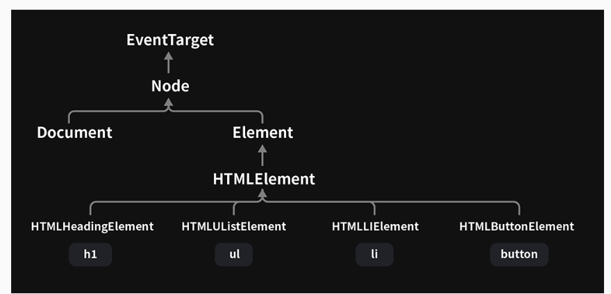
## 요소 선택과 탐색
⭐ DOM의 모든 기능을 배우지는 않음
- 핵심 기능들을, 학습해 온 자바스크립트 지식과 접목하여 이해 

**I. 요소 선택**
- Document 또는 Element의 인스턴스 메서드들. 자식 클래스들로 상속됨 

**1. `getElementsByTagName`- 태그명으로 선택**
- document에서 사용시 문서 전체에서 선택
- 💡 반환값: 🔗 `HTMLCollection` - 유사 배열 객체 & 이터러블

**⭐ 요소 노드에 사용시 그 하위에서 선택**
- Element로부터 물려받은 메서드
- 이후의 메서드들에도 동일하게 적용됨
  - $sections[0].getElementsByTagName('li')

**2. `getElementsByClassName` - 클래스명으로 선택**
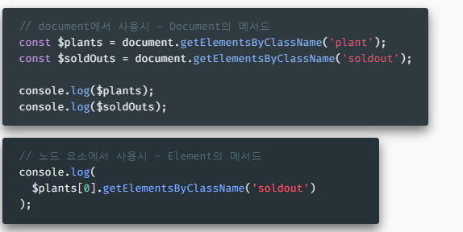

**3. `getElementById` - 아이디로 선택**
- ⭐ Document만의 메서드 - 문서 내 유일한 요소이므로

**4. `querySelector` `querySelectorAll`**
- 주어진 CSS 선택자 첫 번째 또는 모든 요소 반환
- `Document`와 `Element` 모두 갖고 있음

**II. 요소 선택**
**1. 자식 요소 탐색**- 
- Element의 기능 - 하위 요소 노드만 반환

- 🔗 Node의 기능 - 텍스트 노드를 포함한 하위 노드 반환
- 공백도 텍스트 노드에 포함됨
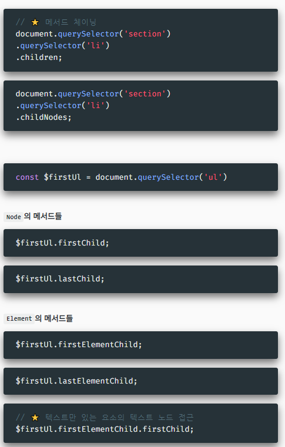

**2. 형제, 부모 노드 탐색**
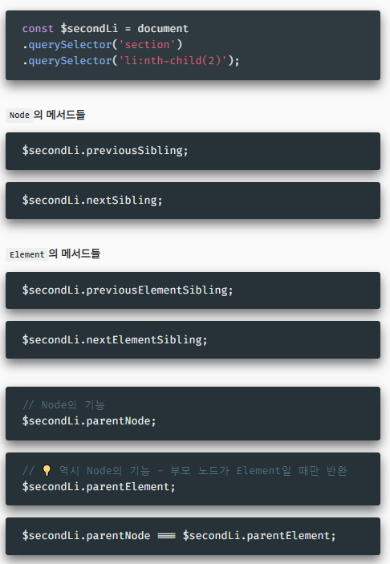

**III 요소 조작**
**1. `textContent` - Node의 기능**
- 텍스트에 관한 접근자 프로퍼티
- 🔗 innerText 대신 쓰는 이유 - 아래 문서 참조
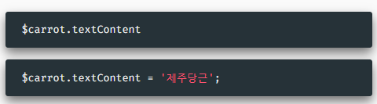

**2. `nodeValue` - `Node`의 기능**
- 텍스트 노드 전용 접근자 프로퍼티 - 다른 노드에서는 null 반환
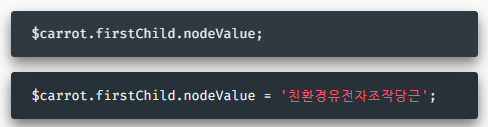

**3. `className` - `Element`의 기능**
- 클래스에 관한 접근자 프로퍼티 - 문자열로 다룸 
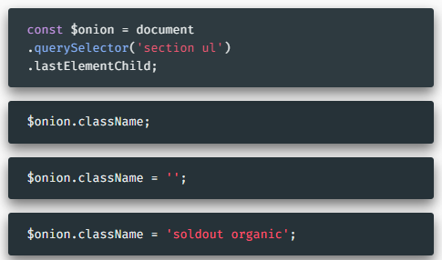

**4. `classList` - `Element`의 기능**
- 클래스에 관한 읽기 전용 프로퍼티
- 🔗 DOMTokenList 반환 - 유사배열객체 & 이터러블
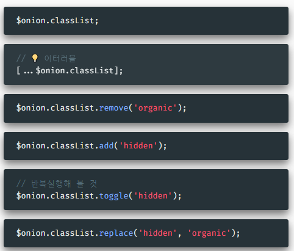

**5. `style` - `HTMLElement`의 기능**
- 스타일에 관한 읽기 전용 접근자 프로퍼티 
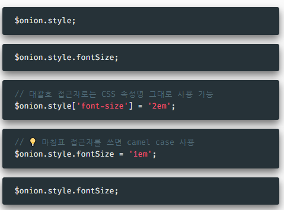
- ⭐ 클래스, 상속 등에 의한 프로퍼티는 접근되지 않음

**6. `getComputedStyle` - 💡 `window`의 기능**
- 인자로 전달받은 요소의 계산된 CSS 속성 정보 반환 
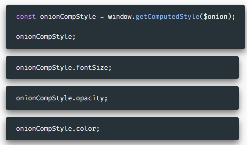

**7. `getAttribute`, `setAttribute` - `Element`의 기능**
- 요소들의 속성에 관한 메서드 
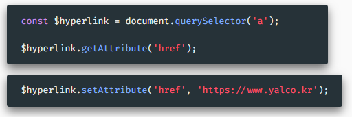

**8. `value`, `checked` - 인풋 요소들의 기능**
- 인풋 값에 대한 접근자 프로퍼티
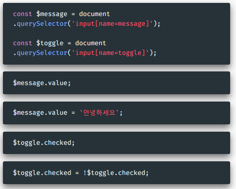

**II. 요소 제거**
`removeChild` - `Node`의 기능
- 인자로 주어진 자식 노드들 제거- 자식 노드이어야 동작
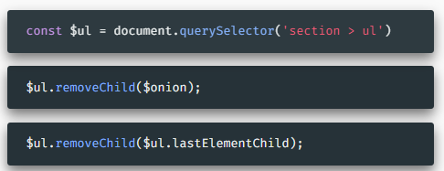
**⭐ 자식 요소 모두 지우기**
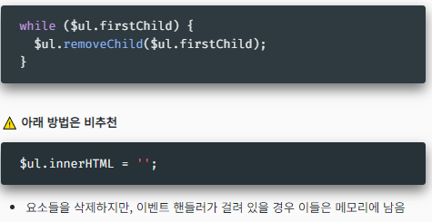

**III. 요소 생성 및 추가**
`createElement` - `Document`의 기능
- 인자로 주어진 태그명의 Element 요소 생성하여 반환
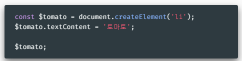

`appendChild` - `Node`의 기능
- 인자로 주어진 요소를 자식요소 중 마지막 위치로 이어붙임
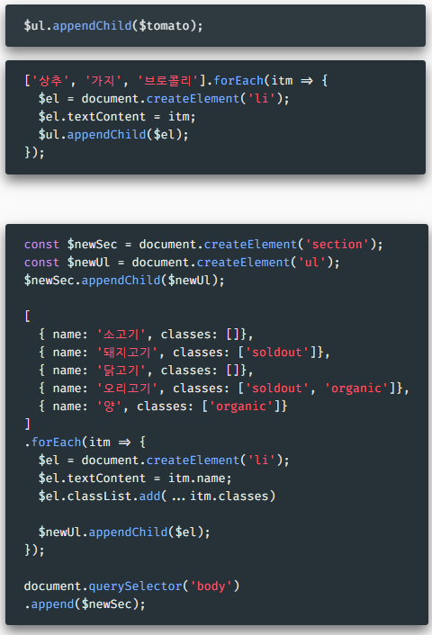

