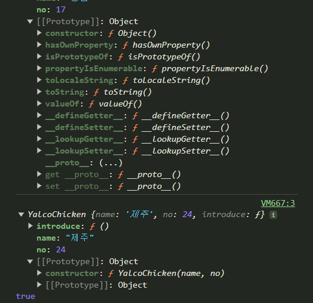
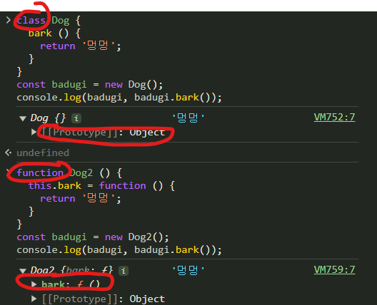
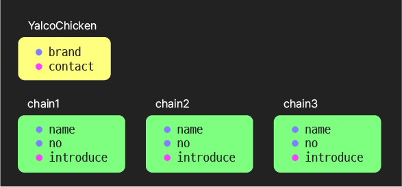
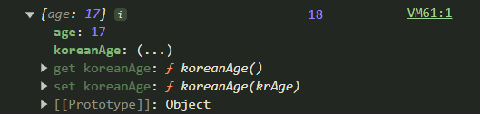
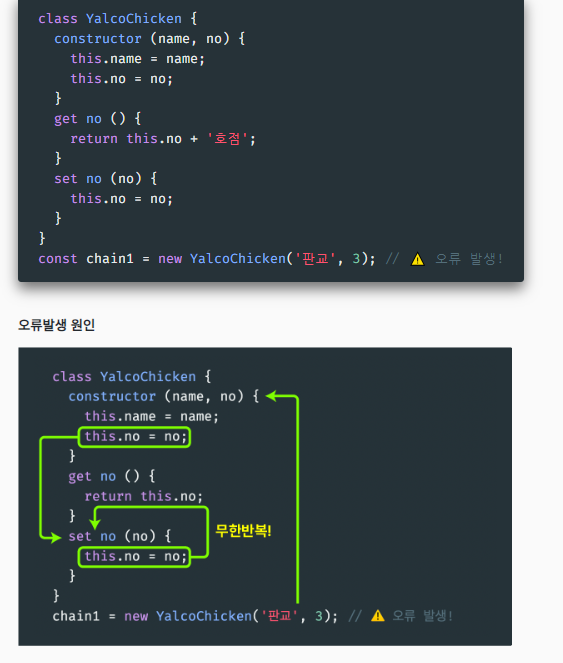
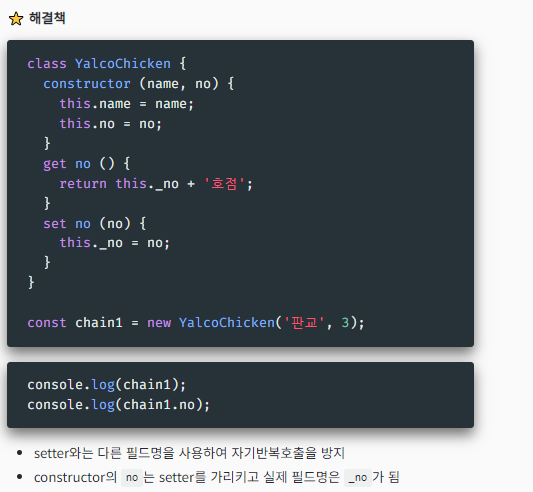

# 객체와 클래스
⭐️ ⭐️ ⭐️ ⭐️ ⭐️ ⭐️ 
## 객체의 기본 사용법
[기본 사용법](./objectBasic.js)
⚠️ **객체나 배열을 키값으로 사용시**
- 실제로 해당 객체나 배열의 내용이나 참조값이 키가 되는 것이 아니라
- [object object]이런식으로 들어가있음.
- 객체를 문자열로 치환해서 넣어버림

=> **배열, object는 key값으로 쓰지 말아야한다.**

**객체 : 프로퍼티 삭제도 가능하다**
- delete person1.age -> delete 연산으로 가능
- 함수 인자로 동적으로 설정도 가능. 

**ES6 추가 문법**
- 객체 선언 시 프로퍼티 키와 대입할 상수/변수명이 동일할 시 단축 표현
- ES6 부터는 `메서드의 정의가 약간 다르다`. 
- 이전에는 salutate: function(formal){ return formal?,,,:,,,} 식도 메서드였는데
- 이젠 salutate(formal){return formal?,,,:,,,,}식으로 해야한다. 
  > 메서드 정의 달라진 거 한 번 더 찾아보기. 잘 모르겠음. 

?? 개인적으로 JS에서 Object와 class의 차이를 잘 모르겠음. (C++의 Class - struct 정도의 차이라고 생각했는데)

⭐️ ⭐️ ⭐️ ⭐️ ⭐️ 
## 생성자 함수
[생성자 함수](./constructor.js)
- 일반적으로 `대문자`로 시작한다. < 보통 대문자로 시작하는건 생성자 함수다. 컨벤션 규칙에 적용시키자! ( 파스칼 케이스 )
- 생성자 함수로 만들어진 객체를 인스턴스 instance 라 부름
- this.~로 생성될 인스턴스의 프로퍼티들 정의
- 생성자 함수는 `new` 연산자와 함께 사용
- 암묵적으로 `this 반환`
  - 실제로 console.log()로 찍어보면 본인을 반환함.
- 생성자 함수에서는 `메서드 정의 불가` - 객체 리터럴과 클래스에서는 가능

- ⚠️ **new를 붙이지 않으면 undefined 반환**
- **function으로 선언된 함수는 기본적으로 생성자 함수의 기능을 갖으나, new를 사용하지 않으면 그냥 함수로 사용되고, new를 붙이면 생성자 함수로 사용됨**

=> 그럼,,,, **💡 "객체를 반환하는 함수랑은 뭐가 다르지??"**

**생성자 함수로 만들어진 객체**
- 프로토타입 `prototype` - 자바스크립트 객체지향의 중심
  - js에는 원래 class가 없고 prototype이었다. 최근에 class가 추가된 것이다. 
  - 왜? 다른 언어랑 통일하려고! 
- 타 언어의 클래스와는 다르며 사용하기에 따라 더 강력함
  - ⚠️ 사실 introduce와 introEng은 종류가 다름 (인스턴스 vs 프로토타입) < prototype에서 더 알아보기.
- 생성자함수명.prototype.함수명 = function(){return}을 통해서 다른 기능을 추가할 수 있다.-> 먼저 생성한 object들도 이 기능이 추가된다.! 개신기! << **new 생성자함수를 객체 반환 함수 대신 사용하는 이유.**

**생성자 함수 자체의 프로퍼티와 함수**
- console.log(YalcoChicken.contact()); << 생성자 함수 자체에 추가.(함수도 변수다!)
- console.log(chain1.contact()); << chain1에만 추가
- 근데 그냥 .으로 프로퍼티 추가 하면(prototype 없이), 이미 만들어진 instance들에는 추가 안됨. 

 
**💡 new 생략 실수 방지하기**
 - function 생성자함수명( 인자 ){~~`, if(!new.target){return new 생성자함수명(인수)}} << 재귀로!! 방지 가능! 

⭐️ ⭐️ ⭐️ ⭐️ ⭐️ 
## 클래스 (Class)
[class MDN](https://developer.mozilla.org/ko/docs/Web/JavaScript/Reference/Classes)
[클래스](./class.js)
- JS는 prototype, 생성자를 사용했는데 타언어랑 통일해주려고 class로 눈속임 한거래   
  - 💡 Syntactic Sugar - 문법을 보다 읽기 쉽게 만드는 것
  - class로 눈속임 한 걸 Syntactic Sugar이라 함. 
- ⚠️ 그러나 클래스와 생성자 함수의 동작이 동일하지는 않음
  - 1. 클래스는 호이스팅 되지 않는다.
  - 2. 클래스는 new 없이 사용하면 오류가 난다 ( 생성자 함수는 오류 없이 undefined )
  - 3. 클래스는 `엄격 모드`를 사용한다. < 이후에 배움

**constructor 메서드**
- 인스턴스 생성시 인자를 받아 `프로퍼티를 초기화`함
- 클래스에 `하나만` 있을 수 있음 - 초과시 오류 발생
- 다른 메서드 이름을 쓸 수 없음
- `기본값` 사용 가능
- 필요없을 (인자가 없을 때 등) 시 생략 가능
- **⚠️ 값을 반환하지 말 것! 생성자 함수처럼 암묵적으로 this 반환**

**클래스의 메서드**
- 클래스는 함수가 prototype에 들어가 있음.
- 생성자 함수는 객체에 들어감.
  => 클래스는 매번 본사에서 받아서 쓰는 개념이다.

**필드 field**
- `constructor 밖에서 this.~ 없이` 인스턴스의 프로퍼티 정의
- 지원하지 않는 브라우저가 있어도 Barbel로 해결 가능.
  - Before) class 클래스명 { constructor(){ this.name=머머머~}}
  - After) class 클래스명{name=머머머; op=4; attack(enemy){enemy.hp -= this.op; this.hp+=this.op/4} }

**static 필드**
- class에서는 static으로 가능. << class 자체의 기능. 
- 인스턴스의 수와 관계없이 메모리 한 곳만 차지
- 인스턴스 없이 클래스 차원에서 호출
- 메모리 상에서, YalkoChicken이 있는 메모리에 정적으로 만들어 놓은 변수, 함수가 있고 다른 인스턴스들은 따로. 

  => introduce 함수는 메서드이기 때문에 이 또한 `그 본체는 본사의 프로토타입 한 공간에 들어있다`. -> 프로토타입 섹션에서 자세히.
- ⚠️ 정적 메서드에서는 정적 필드만 사용 가능 
  - => static 메서드는 static 변수만 사용 가능하다는 것임. 

++ 💡 클래스는 함수 
  > tyepof로 찍어보면 function으로 나옴
  => 함수의 일급 객체 섹션에서, 함수도 다른 곳에 할당할 수 있는 일급 객체라고 했다.
  => 클래스 = 함수? 클래스도 할당 가능한 일급 객체란 소리.

**컴퓨터 프로그래밍 언어 디자인에서, 일급 객체(영어: first-class object)란 다른 객체들에 일반적으로 적용 가능한 연산을 모두 지원하는 객체를 가리킨다. 보통 함수에 인자로 넘기기, 수정하기, 변수에 대입하기와 같은 연산을 지원할 때 일급 객체라고 한다.-wikipedia/일급객체

## 접근자 프로퍼티와 은닉
- getter, setter : 스스로는 값을 갖지 않고 다른 프로퍼티 값을 읽거나 저장 시 사용
- get, set을 앞에 붙임
- 함수처럼 지정되었지만 프로퍼티 처럼 사용된다>>chain1.chainTitle
- 
- 객체 리터럴 뿐만 아니라 클래스에서도 사용 가능하다.
  - 클래스에서는 프로토타입이 된다 - 콘솔에서 객체의 [[Prototype]] 에서 확인해 볼 것.
**어떨 때 사용되나요?**
- getter
  - 반드시 값을 반환해야함.
  - 특정 프로퍼티(들)를 원하는 방식으로 가공해서 내보내야 할 때
- setter
  - setter는 하나의 인자를 받음
  - 특정 프로퍼티에 값이 저장되는 방식을 조작하거나 제한하는데 사용

  why? getter랑 setter를 사용하는 이유와 클래스 메서드와의 차이
  -> 클래스 메서드로도 다 가능한데 왜 쓰냐?
  1) getter와 setter를 사용하는 편이 데이터 무결성이 높다. (유효성 검사와 추가 로직의 적용)
  2) 직관성과 접근성 - 개발자 사이에서 인스턴스의 변수를 변경하거나 조회 한다는 걸 알 수 있음.
  3) 유연성과 확장성 : 객체 내부 구현이 변경되어도, getter와 setter의 인터페이스(메서드 이름과 사용 방법)이 변경되지 않으면 수정할 필요가 없다. 
  :: 그럼 메서드를 왜씀?
   - getter와 setter는 인스턴스의 속성값만 조절할 때 쓰지. 다른데는 안쓰는 듯
   - 예를들어, 은행 계좌 관리 프로그램이면 잔액 조회와 잔액 설정 정도는 getter과 setter를 쓴다. 
   - 근데 입금이나 출금 같은 경우에는 그 과정에서 로그를 남기거나 다른 외부 제약사항을 고려해줘야 할 수 있기 때문에 메서드를 사용하는 것이 옳다. 
  => 뭔가 다 개발자의 개인 역량에 따라서 고민하고 사용해야할 듯 하다.

⚠️ 필드 이름과 setter의 이름이 같을 때 : 생성자 호출 시 set no가 실행됨 >> 무한 반복. this.no

해결책

- setter와 다른 필드명을 사용해서 자기 반복 호출 방지. 
- constructor의 `no`는 setter를 가르키고 실제 필드명은 `_no` 가 된다.

**근데 사실, 인스턴스 이름을 알면,,, 변수에 바로 접근해서 쓸 수 있지 않나? ex) console.log(chain._no) // 4**

## 은닉
💡 **캡슐화 encapsulation**
- 객체지향의 주요 오소 중 하나 - 객체 내부의 값을 (은닉)
- 인스턴스의 프로퍼티 값을 함부로 열람하거나 수정하지 못하도록
- 자바스크립트의 필드는 기본적으로 public 

**private를 통해 은닉함**
- JS에서는 #을 통해서 은닉함. 
- constructor, 접근자 프로퍼티 또는 기타 함수에서 접근 가능
- 인스턴스에서 바로 접근은 못하도록 은닉, 위 방법들로 제어