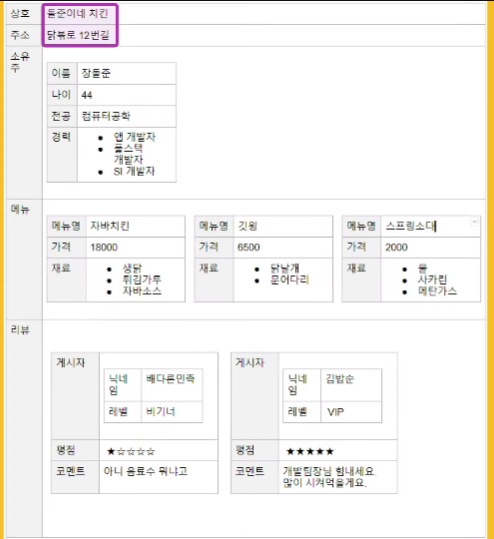

# JSON, XML, YAML?

**JSON, XML을 주로 사용**
구조가 있는 정보(ex) 표)를 어떻게 보내야 할까? 심지어 겹겹이있다면?
-> 전송, 정해진 형식이 필요하다! 

서버-클라이언트가 정보를 주고 받을 땐, text(메시지)로 주고받는다.
-> 구조를 위한 형식이 필요하다! 

1. `XML`
- <tag></tag>를 써서 보낸다. 
- html과 유사함! (+ html은 xml 형식으로 웹을 표현할 수 있게 만든 것이다! )
=> 작성하기 번거롭고, 가독성도 그닥, 장황...

2. `JSON`
- JS 객체 형태로 데이터를 표현한다. GOOD
- 간결하며 작성하기 쉽다. 

JSON vs XML
- json은 문법 오류에 취약하다 : 콤마, bracket 하나에 작동하지 못한다. < xml은 tag하나 오타나도 ㄱㅊ
- json은 주석도 못담 < xml은 가능
- XML은 검증이 편리하다. 

=> 안정을 중요시하는 곳에서는 XML, 가벼운 곳에선 JSON을!! 

3. `YAML(야믈)`
- `사람`에게 가독성 좋게 보여주는 것을 목표로 하는 것이다. 
- 주석 가능하고, 상속도 가능하다. 
- Docker, sprint 등의 설정 파일에 주로 사용된다. < 보기 좋으니까! 
