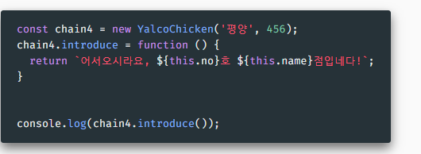

# 프로토타입

## 프로토타입의 개념
- 자바스크립트는 프로토타입 기반의 객체지향 프로그래밍을 지원하는 언어
- 오늘날에는 클래스가 더 널리 사용되지만, 사용하기에 따라 보다 강력하고 효율적
- ⭐ 자바스크립트의 모든 객체는 Prototype을 가짐

**I. Object - 모든 것의 조상**
  - 아래 각 객체의 [[Prototype]]의 [[Prototype]]이 Object임 확인
  - 각 [[Prototype]]의 메서드들 확인
  **💡 프로토타입 체인**
    - 특정 객체에 호출된 프로퍼티가 없다면 프로토타입을 거슬러 올라감
    - 예: Array에는 valueOf가 없지만 그 프로토타입인 Object에는 있으므로 호출 가능

**II. 코드로 프로토타입에 접근하기**
1. `__proto__` 접근자 사용 - Object.prototype의 프로퍼티
  - ⚠️ Deprecated - `사라질 기능, 사용 권장되지 않음`. 위의 링크 확인
  - 아직 많이 사용되지만 이제 권장하지 않는다!
  [MDN](https://developer.mozilla.org/ko/docs/Web/JavaScript/Reference/Global_Objects/Object/proto)
  - 같은 종류는 프로토타입 공유를 한다. 
  - 최상위 공통 조상은 `Object`

2. `Object.getPrototypeOf` 
  - 수정할 때는 Object.setPrototypeOf 사용
  - ⭐`__proto__` 대신 이 기능을 사용할 것

3. ⭐ 생성자 함수에서는 prototype으로 프로토타입 접근 가능
  - 즉 `function` 으로 선언된 함수들에서 

**IV. 인스턴스 vs 프로토타입 프로퍼티**

- `introduce` : 만들어지는 인스턴스마다 각각 있음
- `introEng` : 프로토타입에만 있음 - 메모리 절약

=> 프로토타입에만 저장해두는게 전체 메모리 절약에 도움이 된다. 

**💡 따라서 메모리 사용을 최소화하려면 아래와 같이 작성**

💡 프로토타입 레벨의 함수를 인스턴스 레벨에서 덮어쓰기 가능

⭐ 클래스에도 적용 가능
