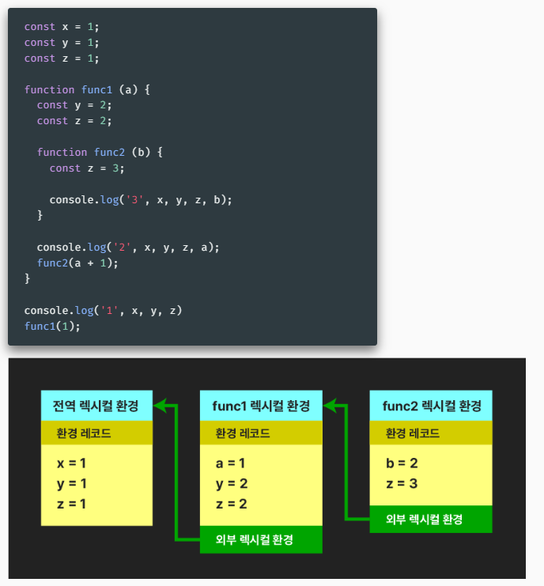
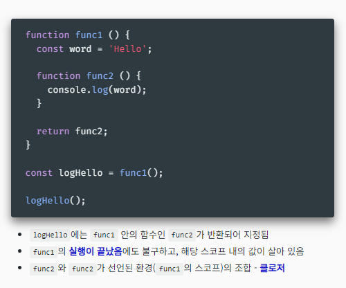
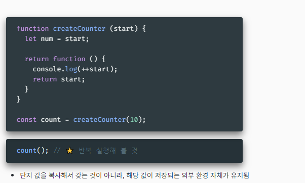

# 스코프와 this 바인딩

## 렉시컬과 클로저

**렉시컬(정적) 스코프 lexical(Static) scope**
- 변수나 상수가 코드상 어디에서 지정되었는가에 따라 그 사용 범위를 결정
- 함수가 코드상 어디에서 정의되었는가에 따라 그 상위 스코프를 결정
- 호출한 곳을 기준으로 하는 동적 스코프 dynamic scope 와 상반되는 개념

**렉시컬 환경 lexical environment**
- 전체 문서, 함수, 블록을 실행하기 전 만들어지는 내부 객체
- 각 스코프의 고유 값들과 외부 스코프에 대한 참조를 포함
- 구성요소
  - 환경 레코드 environment record - 해당 스코프의 데이터들
  - 외부 렉시컬 환경에 대한 참조 outer lexical environment reference

**클로저 closuer**
- 내부 함수에서 외부 함수의 값에 접근할 수 있다는 개념 - 함수 중첩시

**⭐️ private field 흉내내기**
