# 코드 파일 다루기 

## HTML에불러오는 방법들
[html 파일](./index.html)
[js 파일](./script.js)

**1. 헤드에 스크립트로 로드**
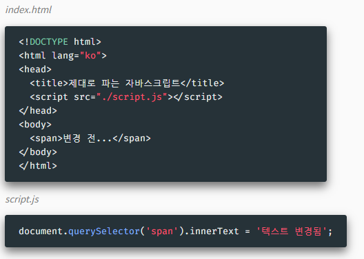
- 스크립트가 동작하지 않는다 ? > 스크립트 로드 시점에는 body 요소가 로드되지 않았다.
- 스크립트의 크기가 클 경우 그 아래 요소들의 로드가 지연된다. - `동기적 로드`
=> 브라우저는 html을 파싱하면서 script를 같이 불러와서 즉시 읽는다. 

어떡하지?
**2. body 요소들 아래에 로드**
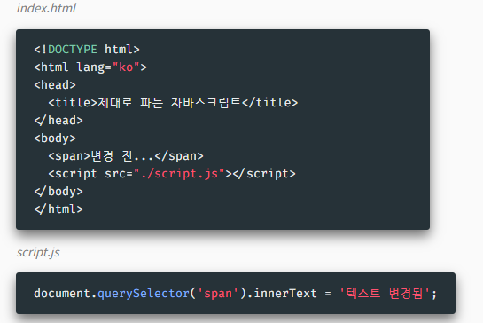
- 동작은 하지만 좋은 코드가 아님 - 문서가 줄 수가 많다면....

**3. onload 이벤트 사용 (구 사용법)**
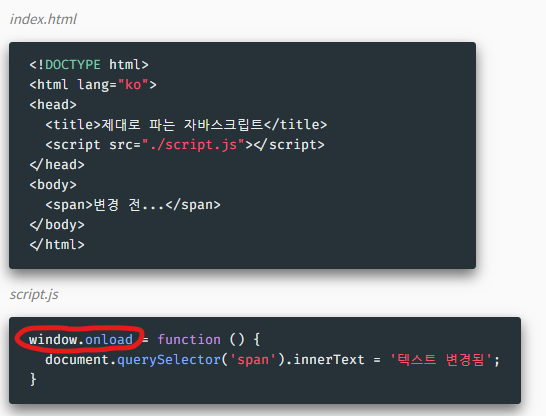
- html이 모두 파싱된 다음에 실행한다. 
  - 윈도우 안의 요소들이 모두 로드된 다음에 실행해라~ 라는 거. 

- 스크립트를 실행하기 위한 onload 이벤트 등록 필요
- 문서의 동기적 로드 문제 여전
  - `js 파일 크기가 너무 크면, js 파일이 로드되는 동안 아래 html 태그의 파싱이 멈춤.`

**4. async/defer 로드 (신 사용법)**
- defer이 더 추천 됨
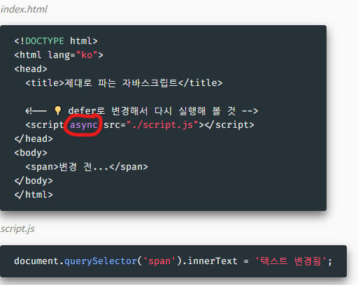

- 방식 별 차이??
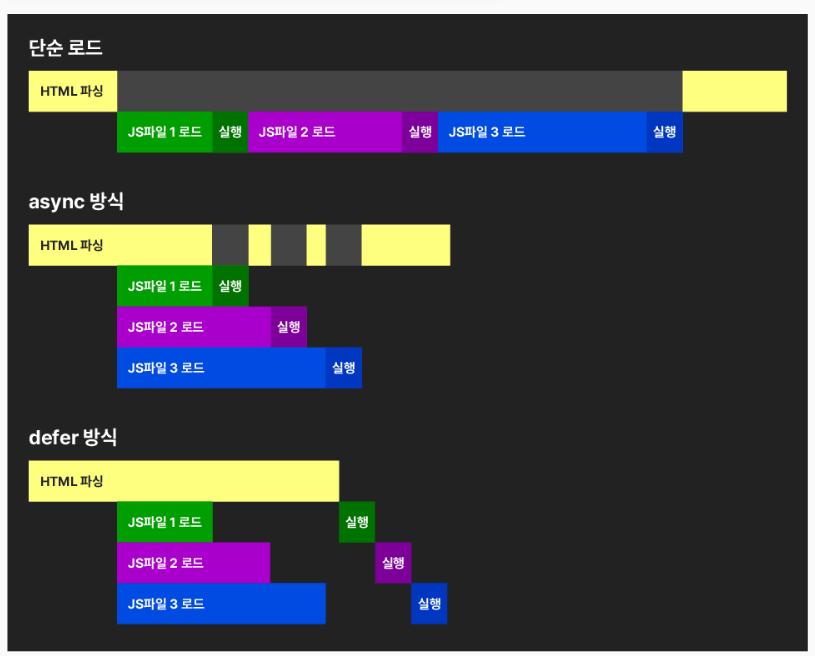

**⭐ defer가 가장 좋은 방식**
- 비동기적으로 문서를 로드하고 HTML 파싱 후 모두 실행하므로
- 파싱이 멈추지도, 타이밍에 의한 오류도 일어나지 않는다. 

## 모듈과 라이브러리 

**⭐ 페이지에 자바스크립트 파일 여럿을 로드할 때 문제점들**

1. 네임스페이스 문제
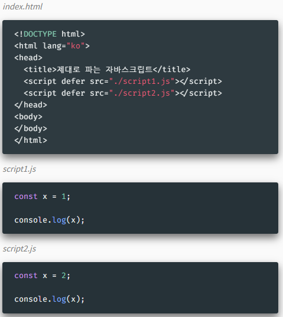
- 같은 상수나 변수명이 둘 이상의 파일에서 사용되었으므로 오류 발생
- 다른 파일에 상수/변수명이나 함수명이 중복 사용되지 않았는지 확인해야 함
- 규모가 큰 웹페이지를 분업하여 만들 때 특히 큰 어려움

2. 파일의 순서 문제
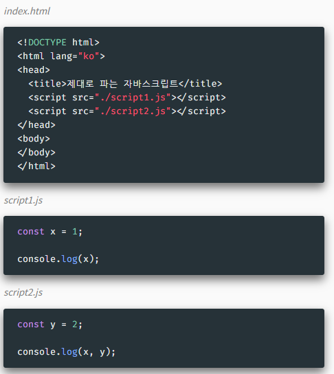
-  script1.js와 script2.js의 위치를 바꿔 볼 것
- 다른 파일의 코드가 필요할 경우 순서에 의존적임
- 한 파일의 코드가 다른 파일의 변수에 영향을 미칠 수 있음 - 오류 위험
- 결국 큰 .js 파일 하나를 나눠 작성하는 것에 불과

=> 1번과 2번을 해결하기 위해 모듈을 사용한다. 

**모듈 사용하기**
[html](./src/mod.html)
[js](./src/module1.js)
-> 웹팩과 바벨에서도 모듈 개념이 사용됨
1. 기본 사용법
- 모듈로서 로드할 파일에는 type="module" 속성을 넣어줌
- ⭐ 모듈은 자동으로 defer로 로드됨
- ⭐ 실행코드가 들어있는 파일만 로드하면 됨

- ⭐ `export`
- 따라오는 식별자를 다른 모듈에서 사용할 수 있도록 공개함
- `상수, 변수, 함수, 클래스` 모두 export 가능

- ⭐ `import`
- 타 모듈에서 공개한 식별자를 자신의 스코프로 로드
- 모듈의 요소들을 객체 디스트럭쳐링 방식으로 가져올 수 있음
  - 💡 `as`로 원하는 이름으로 바꾸어 가져올 수 있음 - `식별자 중복 방지`

2. 여러 모듈들을 가져와 사용하기 - main.js, module1, 2, 3

3. 하나의 모듈 객체로 묶어서 가져오기 - main.js, module4
  - `*` : wildcard

4. 이름없는 하나의 값으로 반환하기 - main.js, module5
- 한 모듈에서 하나만 사용 가능
- 일반적으로 특정 주제의 기능들을 하나의 객체로 담아 공개

5. ⭐ **모듈에서는 `await`을 바로 사용 가능**
  - 코드 자체가 하나의 async 문 안에서 돌아간다 볼 수 있다.
  -> async 필요 없다는 말
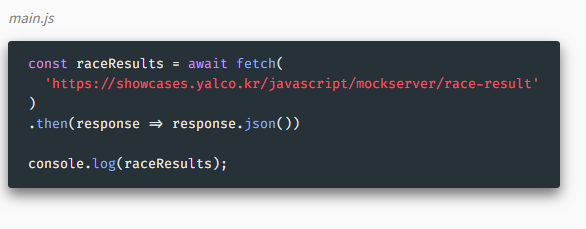

6. Node.js에서 모듈 사용
- ⭐ package.json의 객체에 아래의 type 항목 추가
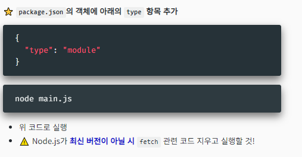
-> node.js는 require 방법으로 import해서 그럼. 

**⭐ 외부 라이브러리 로드**
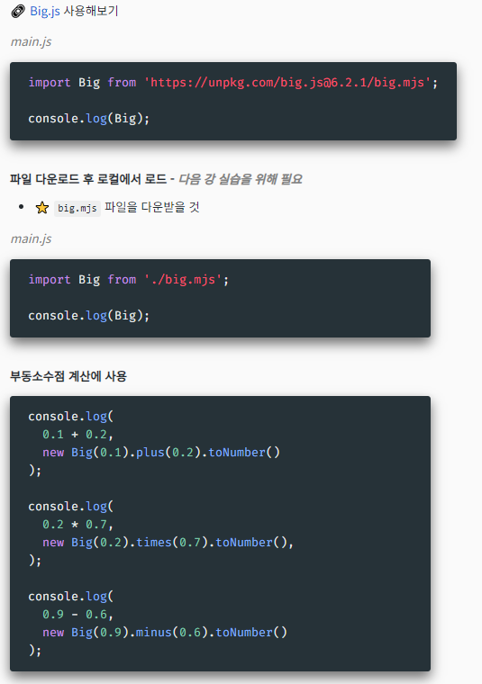
- mjs에서 m은 모듈임을 나타내기 위해 붙이곤 한다. 
- Node.js에서 실행시키려면 Big.mjs 로컬로 가져와

## 웹팩과 바벨 

**웹 팩(webpack)**
[🧊 공식 사이트 보기](https://webpack.js.org/)
- `번들러 bundler` - 프로젝트에 사용되는 파일들을 하나 또는 소수의 파일들로 압축
- 어플리케이션이 로딩 및 실행 속도 향상
- 각종 플러그인과 옵션을 사용하여 코드를 다양한 방법으로 변환/압축 가능
- 동종/유사 제품: `RollUp, Parcel, Gulp, Vite...`

**⭐ 프로젝트에 웹팩 사용해보기**

0. 소스 저장소 분리하기
  - `src` 폴더를 만들고 `.js`파일들 모두 이동

1. 프로젝트에 웹팩 설치
  `npm install webpack webpack-cli --save-dev`
  -> node_modules 폴더 생김.

2. 웹팩 설정 파일 `webpack.config.js`
  - ./src/main.js 파일과, 연결된 모든 모듈들을 ./dist/main.js 파일로 통합
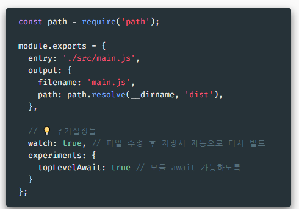

3. 빌드 명령 추가 `package.json`
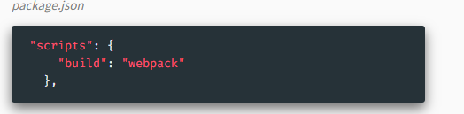
- script 항목에 "build": "webpack" 추가
- { "type": "module" } 부분 제거하기

**바벨**
[공식 사이트](https://babeljs.io/)
- 자바스크립트를 보다 오래된 환경에서 동작할 수 있는 버전으로 컴파일 
- 기타 방법 : 타입스크립트 컴파일러 사용

1. 사이트에서 체험
...

