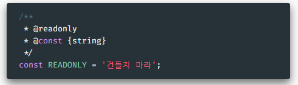

# 코드 파일 다루기 

## ⭐ JSDoc
[JSDoc](https://jsdoc.app/)
- 자바스크립트 코드에 주석을 달기 위한 🔗 마크업 언어
- 에디터, IDE에서는 작성된 내용에 따라 코드 힌팅 등의 기능 제공
- 👉 마치 타입스크립트 등의 언어처럼 인자 등의 자료형 제안 - 강제되지는 않음
- 도구를 통해 웹 문서 등으로 출력될 수 있음

**`@type` - 자료형 명시, `@const` - 상수임 명시**

**`@param` - 인자**

**`@typedef`, `@property` - 커스텀 객체 타입 지정**

**`@constructor`, `@class` - 생성자 용도로 작성된 함수, 클래스**
- new 키워드와 함게 사용하여 객체를 생성함
- 클래스의 생성자에는 @constructs

**`@todo` - 이후 해야 할 일 표시**

**`@see`, `@link` - 참조, 링크**

**`@readonly` - 읽기 전용**

**`@deprecated` - 사라지게 될 기능**

**문서 생성해보기**
- API 문서 생성기 -> JSDoc 사용
- ⭐ 프로젝트 디렉토리에 _로 시작하는 폴더가 포함되지 않아야 함 - 위 생성기의 버그
`npm install -g jsdoc`
[JSDoc 더 알아보기](https://github.com/jsdoc/jsdoc#readme)